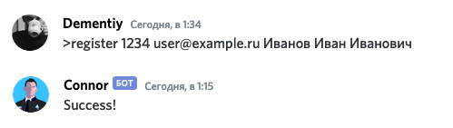

# Программирование на Python

[//]: # ({: .center style="width:40%;"})

Примерный план на первый семестр:

| Тема | Дополнительные материалы | Задания |
|------|--------------------------|---------|
|  Введение. Знакомство с языком   | [«Укус Питона»](https://wombat.org.ua/AByteOfPython/) и [How to Think Like a Computer Scientist](https://runestone.academy/runestone/books/published/thinkcspy/index.html) | Необходимо [настроить рабочее окружение](assignments/setup_env.md) |
| [Неизменяемые](lectures/immutable-types.md) и [изменяемые](lectures/mutable-types.md) типы данных | [David Beazley: Introduction to Python](https://dabeaz-course.github.io/practical-python/Notes/01_Introduction/00_Overview.html) и [David Beazley: Working With Data](https://dabeaz-course.github.io/practical-python/Notes/02_Working_with_data/00_Overview.html) | |
| [Управляющие конструкции](lectures/control-statements.md) |  | [Алгоритмы шифрования](assignments/cypher.md) |
| [Повторное использование кода](lectures/functions.md) | [David Beazley: Program Organization](https://dabeaz-course.github.io/practical-python/Notes/03_Program_organization/00_Overview.html) | [Решатель судоку](assignments/sudoku.md) |
| [Пространство имен и области видимости](lectures/ns_and_scopes.md) | | |
| [ООП. Классы](lectures/classes.md) | [David Beazley: Classes and objects](https://dabeaz-course.github.io/practical-python/Notes/04_Classes_objects/00_Overview.html) | [Игра Жизнь](assignments/life.md) |
| [ООП. Наследование](lectures/inheritance.md) |  |  |
| [ООП. Разрешение имен атрибутов](lectures/attribute_lookup.md) и [методов](lectures/mro.md) | [David Beazley: Inner Workings of Python Objects](https://dabeaz-course.github.io/practical-python/Notes/05_Object_model/00_Overview.html) | [Пишем свой Git](assignments/pyvcs.md) |

Практические задания в первую очередь подразумевают выполнение на языке Python, но постепенно шаблоны заданий выкладываются и на языке Go. Все шаблоны работ можно найти в [репозитории курса](https://github.com/Dementiy/pybook-assignments).

Любой желающий может не только выполнить работы, но и попросить помощи в ~~[Slack'e](https://cs102-python.slack.com)~~ [Discord'е](https://discord.gg/DHvm8K) (нужно только получить инвайнт, написав мне на почту `Dementiy@yandex.ru`). Аннотированная версия сайта [тут](https://via.hypothes.is/https://dementiy.github.io).

Студентам следует не забыть зарегистрироваться у бота, чтобы получить доступ к таблице с прогрессом в курсе:

Если регистрация прошла успешно, то на почту будет отправлен инвайт.

Если вы чувствуете необходимость в решении дополнительных задач, то можете обратиться к таким платформам как [Codewars](https://www.codewars.com/) и [HackerRank](https://www.hackerrank.com/), которые предлагают задания разной сложности по таким темам как: алгоритмы и структуры данных, базы данных, математика, искусственный интеллект и т.д. Также можете порешать задачи с ежегодного конкурса [Advent of Code](https://adventofcode.com/).

Буду признателен за любые правки, комментарии, дополнения, новые задания и т.п. Можно написать в слаке, комментариях или использовать аннотированную версию сайта.

**P.S.** Можно поддержать (\^_\^;)

<iframe src="https://money.yandex.ru/quickpay/shop-widget?writer=seller&targets=%D0%9F%D0%BE%D0%B4%D0%B4%D0%B5%D1%80%D0%B6%D0%B0%D1%82%D1%8C&targets-hint=&default-sum=&button-text=11&payment-type-choice=on&hint=&successURL=&quickpay=shop&account=41001313600690" width="450" height="198" frameborder="0" allowtransparency="true" scrolling="no"></iframe>
