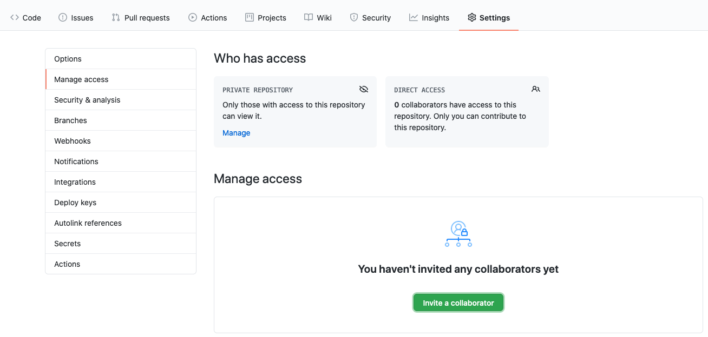
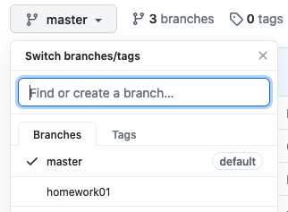
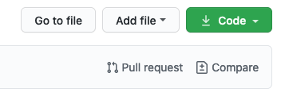
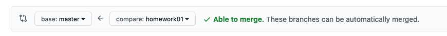

Эта первая практическая работа, которая посвящена базовым конструкциям языка Python. Также в этой работе описан общий подход к выполнению заданий.

Все исходники к работам можно найти в шаблоне [репозитория курса](https://github.com/Dementiy/pybook-assignments). Если вы еще не настроили рабочее окружение, то перейдите в раздел [«Настройка рабочего окружения»](../assignments/setup_env.md).

## Прежде чем приступить к выполнению работы

Перед тем как начать выполнять задания не забудьте перейти в рабочую директорию и активировать ваше виртуальное окружение:

```sh
$ gocs102 && cd homework01
$ workon cs102
```

При выполнении работ мы будем придерживаться простого подхода к ветвлению под названием [GitHub flow](https://guides.github.com/introduction/flow/) (есть и другие подходы, например, [gitflow](https://nvie.com/posts/a-successful-git-branching-model/)). Приступая к новой практической работе создавайте ветку с именем этой работы:

```sh
(cs102) $ git checkout -b homework01 master
Switched to a new branch 'homework01'
```

Чтобы отобразить список локальных веток можно воспользоваться командой `git branch`:

```
(cs102) $ git branch
* homework01
  master
```

Символ `*` указывает на какой ветке вы находитесь. Для переключения между ветками используйте команду `git checkout имя_ветки`.

## Шифр Цезаря

[Шифр Цезаря](https://ru.wikipedia.org/wiki/Шифр_Цезаря) является одним из самых простых методов шифрования. Для кодирования сообщения все буквы алфавита сдвигают на три символа вперед:

```
A -> D, B -> E, C -> F, и так далее
```

Сдвиг трёх последних букв алфавита:

```
X -> A, Y -> B, Z -> C
```

Используя шифр Цезаря, слово `PYTHON` будет закодировано следующим образом:

```
PYTHON
||||||
SBWKRQ
```

Вам необходимо написать тело для следующих двух функций в файле `caesar.py`:

```python
def encrypt_caesar(plaintext: str, shift: int = 3) -> str:
    """
    Encrypts plaintext using a Caesar cipher.

    >>> encrypt_caesar("PYTHON")
    'SBWKRQ'
    >>> encrypt_caesar("python")
    'sbwkrq'
    >>> encrypt_caesar("Python3.6")
    'Sbwkrq3.6'
    >>> encrypt_caesar("")
    ''
    """
    ciphertext = ""
    # PUT YOUR CODE HERE
    return ciphertext


def decrypt_caesar(ciphertext: str, shift: int = 3) -> str:
    """
    Decrypts a ciphertext using a Caesar cipher.

    >>> decrypt_caesar("SBWKRQ")
    'PYTHON'
    >>> decrypt_caesar("sbwkrq")
    'python'
    >>> decrypt_caesar("Sbwkrq3.6")
    'Python3.6'
    >>> decrypt_caesar("")
    ''
    """
    plaintext = ""
    # PUT YOUR CODE HERE
    return plaintext
```

Обратите внимание, что вторым аргументом функции является сдвиг (`shift`), например, при сдвиге равном нулю сообщение останется без изменений (`A -> A, B -> B, ...`).

!!! hint
    Воспользуйтесь встроенными функциями `ord()` и `chr()`. Функция `ord()` позволяет получить код указанного символа, а `chr()` работает наоборот - возвращает символ по его коду.

!!! note
    О кодировках можно почитать [тут](http://kunststube.net/encoding/) и [тут](http://farmdev.com/talks/unicode/).

В результате переменные `ciphertext` и `plaintext` должны содержать зашифрованное и расшифрованное сообщения соответственно.

Проверить работу функций можно с помощью примеров, приведенных в [доктестах](https://docs.python.org/3.5/library/doctest.html) (текст внутри функции, который заключен в тройные кавычки и похож на работу с интерпретатором в интерактивном режиме). Запустить доктесты можно с помощью следующей команды (при условии, что файл с программой называется `caesar.py`):

```sh
(cs102) $ python -m doctest -v caesar.py
```

Доктесты обычно играют роль примеров и не используются в качестве полноценного фреймворка для автоматического тестирования. Поэтому мы будем использовать стандартную библиотеку [unittest](https://docs.python.org/3/library/unittest.html) для тестирования наших приложений (наиболее популярной альтернативой является [pytest](https://docs.pytest.org/en/stable/)). Для запуска тестов можно воспользоваться следующей командой:

```sh
(cs102) $ python -m unittest -v tests.test_caesar
```

или для запуска всех тестов:

```sh
(cs102) $ python -m unittest discover
```

Также обратите свое внимание на официальное руководство по стилю [pep8](https://www.python.org/dev/peps/pep-0008/) (некоторые пояснения по оформлению кода можно найти [здесь](https://github.com/Dementiy/pydonts)).

Если вы добились успешного прохождения тестов, не забудьте сделать коммит, который зафиксирует ваши изменения, например:

```sh
(cs102) $ git add homework01/caesar.py
(cs102) $ git commit -m "Реализована функция encrypt_caesar()"
```

и аналогично:

```sh
(cs102) $ git add homework01/caesar.py
(cs102) $ git commit -m "Реализована функция decrypt_caesar()"
```

!!! note
    Вы можете воспользоваться приложением [Source Tree](https://www.sourcetreeapp.com/) для наглядного отслеживания вносимых изменений.

Также не забывайте периодически отправлять ваши изменения на сервер:

```sh
(cs102) $ git push origin homework01
```

## Шифр Виженера

[Шифр Виженера](https://ru.wikipedia.org/wiki/Шифр_Виженера) очень похож на шифр Цезаря, за тем исключением, что каждый символ сообщения сдвигается на определяемое ключом значение. Ключ - это слово, каждый символ которого указывает на сколько позиций должен быть сдвинут соответствующий символ в шифруемом сообщении. Так, `A` означает сдвиг на `0` символов, `B` на `1` и т.д.

Если длина ключа меньше длины слова, подлежащего шифрованию, то ключ повторяется необходимое число раз, например:

```
Простой текст: ATTACKATDAWN
Ключ: LEMONLEMONLE
Зашифрованный текст: LXFOPVEFRNHR
```

Ваша задача написать тело для следующих двух функций в файле `vigenere.py` так, чтобы переменные `ciphertext` и `plaintext` содержали зашифрованное и расшифрованное сообщения соответственно:

```python
def encrypt_vigenere(plaintext: str, keyword: str) -> str:
    """
    Encrypts plaintext using a Vigenere cipher.

    >>> encrypt_vigenere("PYTHON", "A")
    'PYTHON'
    >>> encrypt_vigenere("python", "a")
    'python'
    >>> encrypt_vigenere("ATTACKATDAWN", "LEMON")
    'LXFOPVEFRNHR'
    """
    ciphertext = ""
    # PUT YOUR CODE HERE
    return ciphertext


def decrypt_vigenere(ciphertext: str, keyword: str) -> str:
    """
    Decrypts a ciphertext using a Vigenere cipher.

    >>> decrypt_vigenere("PYTHON", "A")
    'PYTHON'
    >>> decrypt_vigenere("python", "a")
    'python'
    >>> decrypt_vigenere("LXFOPVEFRNHR", "LEMON")
    'ATTACKATDAWN'
    """
    plaintext = ""
    # PUT YOUR CODE HERE
    return plaintext
```

!!! note
    Обратите внимание, что символы `A` и `a` в ключе не оказывают никакого влияния на шифруемое сообщение. Если же в качестве ключа мы будем использовать `C` или `c`, то получим шифр Цезаря.

По окончании работы над каждой функцией не забудьте запустить тесты и сделать соответствующие коммиты, как в примере с шифром Цезаря.

## RSA шифрование

Одним из современных методов шифрования является алгоритм шифрования RSA, названный так по первым буквам фамилий его авторов (Rivest, Shamir и Adleman).

Мы не будем здесь вдаваться в [подробности работы](http://kpfu.ru/docs/F366166681/mzi.pdf) этого алгоритма (хотя и рассмотрим техническую часть), но [следующего объяснения](https://www.quora.com/How-do-you-explain-how-an-RSA-public-key-works-to-a-child) должно быть достаточно для понимания принципов шифрования с открытым ключом:

!!! quote
    

    Show your kid a padlock. This is a kind of lock that locks when you click it (i.e it doesn't require a key) but requires the key to open the lock.
    
    So, I can send these padlocks to all my friends who want to communicate with me. I will send them only the lock but will keep the key with me.
    
    My friends can write me messages, put it in a box, lock it with my padlock (by clicking it) and send it to me, even over high risk networks. If the box is intercepted, it's contents will not be compromised since I still have the key with me.
    
    When the box reaches me, I can open my padlock with my key and read the contents. This way, I can send padlocks (public keys) to people outside which they can use to lock boxes (encrypt messages) without being in danger of the contents being compromised as the padlock key (the private key) is always with me and never exchanged over the network.

!!! danger
    В методичке опечатка!

Работу алгоритма можно разбить на три шага:

1. Генерация ключей
2. Шифрование
3. Расшифровка

От вас в этом задании требуется выполнить только шаг генерации ключей, остальные два шага уже представлены в шаблоне работы.

На этапе генерации создаётся два ключа: открытый (public key, с помощью которого каждый сможет зашифровать сообщение и отправить его нам) и закрытый (private key, которым мы можем расшифровать полученные сообщения). Для этого выбирается два [простых числа](https://ru.wikipedia.org/wiki/Простое_число) `p` и `q`. Позволим пользователю вводить эти числа и проверяя их на простоту, для этого необходимо написать тело функции `is_prime(n)`:

```python
def is_prime(n: int) -> bool:
    """
    >>> is_prime(2)
    True
    >>> is_prime(11)
    True
    >>> is_prime(8)
    False
    """
    # PUT YOUR CODE HERE
    pass
```

Если вы закончили работу над функцией `is_prime(n)`, то запустите тесты и сделайте коммит:

```sh
(cs102) $ git commit -am "Реализована функция is_prime(n)"
```

!!! info
    Для фиксации изменений мы использовали команду `git commit -am`, которая является аналогом последовательности команд `git add .` и `git commit -m`. 

После того как были выбраны два простых числа требуется найти их произведение `n = p * q`:

```python
def generate_keypair(p: int, q: int) -> Tuple[Tuple[int, int], Tuple[int, int]]:
    if not (is_prime(p) and is_prime(q)):
        raise ValueError('Both numbers must be prime.')
    elif p == q:
        raise ValueError('p and q cannot be equal')

    # n = pq
    # PUT YOUR CODE HERE

    # phi = (p-1)(q-1)
    # PUT YOUR CODE HERE

    # Choose an integer e such that e and phi(n) are coprime
    e = random.randrange(1, phi)

    # Use Euclid's Algorithm to verify that e and phi(n) are comprime
    g = gcd(e, phi)
    while g != 1:
        e = random.randrange(1, phi)
        g = gcd(e, phi)

    # Use Extended Euclid's Algorithm to generate the private key
    d = multiplicative_inverse(e, phi)
    # Return public and private keypair
    # Public key is (e, n) and private key is (d, n)
    return ((e, n), (d, n))
```

Затем вычисляется функция Эйлера по формуе:

$$\phi = (p-1)(q-1)$$

Далее выбирается число `e`, отвечающее следующим критериям:

* `e` — простое;
* `e < phi`;
* `e` [взаимно простое](https://ru.wikipedia.org/wiki/Взаимно_простые_числа) с `phi`.

Определить, являются ли числа взаимно простыми можно с помощью алгоритма Евклида. Для этого необходимо вычислить наибольший общий делитель (НОД) и проверить, **равен ли он единице**. На этом этапе вашей задачей является реализация данного алгоритма:

```python
def gcd(a: int, b: int) -> int:
    """
    >>> gcd(12, 15)
    3
    >>> gcd(3, 7)
    1
    """
    # PUT YOUR CODE HERE
    pass
```

Не забудьте зафиксировать реализацию функции `gcd(a, b)`:

```sh
(cs102) $ git commit -am "Реализована функция поиска НОД"
```

Заключительным этапом на шаге генерации ключей является вычисление `d` такого что `d * e mod phi = 1`. Для его вычисления используется расширенный (обобщенный) алгоритм Евклида (см. стр. 23 [этого учебного пособия](http://kpfu.ru/docs/F366166681/mzi.pdf) с подробными объяснениями).

```python
def multiplicative_inverse(e: int, phi: int) -> int:
    """
    >>> multiplicative_inverse(7, 40)
    23
    """
    # PUT YOUR CODE HERE
    pass
```

Таким образом, полученные пары `(e,n)` и `(d,n)` являются открытым и закрытым ключами соответственно.

Снова запустите тесты и зафиксируйте изменения:

```sh
(cs102) git commit -am "Реализованы функции multiplicative_inverse() и generate_keypair()"
```

## После выполнения всех заданий

После выполнения всех заданий отправьте изменения на сервер:

```sh
(cs102) $ git push origin homework01
```

Проверка работы будет происходит на основе код-ревью со стороны преподавателя(ей) или ассистента(ов). Для этого их необходимо добавить как участников в ваш репозиторий. Перейдите на вкладку `Settings -> Manage access` и нажмите на `Invite a collaborator`:



Затем вернитесь на вкладку `Code` и выбирите ветку `homework01`:



Далее нажмите на `Pull Request`, таким образом, вы сделаете запрос на внесение изменений: 



Изменения должны применяться к ветке `master` (`main`) и не должны содержать конфликтов (`Able to merge`):



Опишите ваш pull request ([как оформлять PR](https://blog.maddevs.io/%D0%BA%D0%B0%D0%BA-%D0%BE%D1%84%D0%BE%D1%80%D0%BC%D0%B8%D1%82%D1%8C-%D0%BE%D0%BF%D0%B8%D1%81%D0%B0%D0%BD%D0%B8%D0%B5-%D0%BA-pull-request-e95ae0177212)) и добавьте проверяющего (`reviewers`), после чего нажмите на `Create pull request`.

Соответствующие ветви можно удалить, например:

```sh
(cs102) $ git branch -d homework01
```
