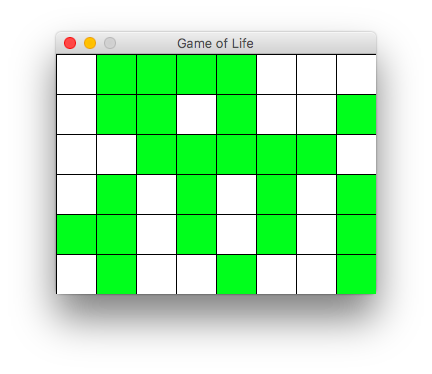
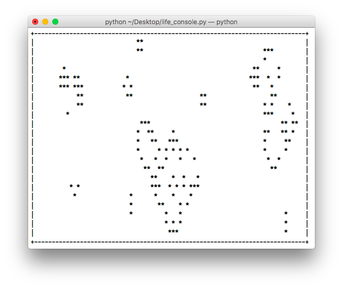

В этой работе вашей задачей является написать симулятор игры «Жизнь».


Игру «Жизнь» изобрел математик [Джон Хортон Конвей](https://ru.wikipedia.org/wiki/Конвей,_Джон_Хортон) в 1970 году. Она пользовалась популярностью не только среди его коллег. Об увлекательности игры «Жизнь» свидетельствуют результаты множества интересных исследований и многочисленные компьютерные реализации. При этом она имеет непосредственное отношение к перспективной области математики - теории [клеточных автоматов](https://ru.wikipedia.org/wiki/Клеточный_автомат).

Правила игры «Жизнь» достаточно простые[^1]:

- «Жизнь» разыгрывается на бесконечном клеточном поле.
- У каждой клетки 8 соседних клеток.
- В каждой клетке может жить существо.
- Существо с двумя или тремя соседями выживает в следующем поколении, иначе погибает от одиночества или перенаселённости.
- В пустой клетке с тремя соседями в следующем поколении рождается существо.

Подробнее про игру «Жизнь» можно прочитать в журнале [Квант](http://kvant.mccme.ru/1974/09/igra_zhizn.htm).

## Быстрый прототип

Для реализации клеточного поля мы будем использовать набор модулей [pygame](http://pygame.org/hifi.html), предназначенный для создания компьютерных игр.

Для начала нам нужно создать игровое поле, на котором будет разворачиваться действие игры «Жизнь». Поэтому напишем класс `GameOfLife`, который принимает следующие параметры:

- `width` - ширина окна (по умолчанию 640px);
- `height` - высота окна (по умолчанию 480px);
- `cell_size` - высота и ширина клетки (по умолчанию 10px).

Ниже приведен пример создания трех игровых полей одинаковых размеров, но с разным рамзером клеток (10, 20 и 40, соответственно):


Далее представлен листинг, который позволяет создать игровое поле:

```python
import pygame
from pygame.locals import *


class GameOfLife:

    def __init__(self, width: int=640, height: int=480, cell_size: int=10, speed: int=10) -> None:
        self.width = width
        self.height = height
        self.cell_size = cell_size

        # Устанавливаем размер окна
        self.screen_size = width, height
        # Создание нового окна
        self.screen = pygame.display.set_mode(self.screen_size)
        
        # Вычисляем количество ячеек по вертикали и горизонтали
        self.cell_width = self.width // self.cell_size
        self.cell_height = self.height // self.cell_size
        
        # Скорость протекания игры
        self.speed = speed
   
   def draw_lines(self) -> None:
        # @see: http://www.pygame.org/docs/ref/draw.html#pygame.draw.line
        for x in range(0, self.width, self.cell_size):
            pygame.draw.line(self.screen, pygame.Color('black'), 
                (x, 0), (x, self.height))
        for y in range(0, self.height, self.cell_size):
            pygame.draw.line(self.screen, pygame.Color('black'), 
                (0, y), (self.width, y))

   def run(self) -> None:
        pygame.init()
        clock = pygame.time.Clock()
        pygame.display.set_caption('Game of Life')
        self.screen.fill(pygame.Color('white'))
        running = True
        while running:
            for event in pygame.event.get():
                if event.type == QUIT:
                    running = False
            self.draw_lines()
            pygame.display.flip()
            clock.tick(self.speed)
        pygame.quit()


if __name__ == '__main__':
    game = GameOfLife(320, 240, 20)
    game.run()
```

!!! note
    Подробное описание всех используемых функций из `pygame` читайте в официальной [документации](http://www.pygame.org/docs/ref/pygame.html).

Каждая клетка может находиться в двух состояниях: «живая» или «мертвая». Нам нужно создать матрицу клеток размером `cell_height` $\times$ `cell_width`, которые в дальнейшем мы будем отображать на нашем поле, окрашивая их в зеленый и белый цвета, для «живых» и «мертвых» клеток соответственно.

```python
def create_grid(self, randomize: bool=False) -> Grid:
    """
    Создание списка клеток.

    Клетка считается живой, если ее значение равно 1, в противном случае клетка
    считается мертвой, то есть, ее значение равно 0.

    Parameters
    ----------
    randomize : bool
        Если значение истина, то создается матрица, где каждая клетка может
        быть равновероятно живой или мертвой, иначе все клетки создаются мертвыми.
    
    Returns
    ----------
    out : Grid
        Матрица клеток размером `cell_height` х `cell_width`.
    """
    pass
```

Пример использования:

```python
>>> from pprint import pprint as pp
>>> game = GameOfLife(320, 240, 40)
>>> grid = game.create_grid(randomize=True)
>>> pp(grid)
[[1, 1, 0, 0, 1, 1, 1, 1],
 [0, 1, 1, 1, 1, 1, 1, 0],
 [1, 0, 1, 1, 0, 0, 0, 0],
 [1, 0, 0, 0, 0, 0, 0, 1],
 [1, 0, 1, 1, 1, 1, 0, 0],
 [1, 1, 1, 1, 0, 1, 1, 1]]
>>> grid = game.create_grid(randomize=False)
>>> pp(grid)
[[0, 0, 0, 0, 0, 0, 0, 0],
 [0, 0, 0, 0, 0, 0, 0, 0],
 [0, 0, 0, 0, 0, 0, 0, 0],
 [0, 0, 0, 0, 0, 0, 0, 0],
 [0, 0, 0, 0, 0, 0, 0, 0],
 [0, 0, 0, 0, 0, 0, 0, 0]]
```

Теперь нам нужно окрашивать клетки в зеленый или белый цвета в зависимости от того живая клетка или мертвая. Каждая клетка на поле представлена прямоугольником размера `cell_size` $\times$ `cell_size`, который можно закрасить с помощью функции `pygame.draw.rect`. Эта функция принимает следующие параметры:

* `Surface` - где нужно отрисовать прямоугольник (в нашем случае это `screen`);
* `color` - цвет, которым следует закрасить прямоугольник (`pygame.Color('white')` или `pygame.Color('green')`);
* `Rect` - координаты прямоугольника в формате `(x, y, длина стороны a, длина стороны b)`.

```python
def draw_grid(self) -> None:
    """
    Отрисовка списка клеток с закрашиванием их в соответствующе цвета.
    """
    pass
```

!!! hint
    Добавьте вызов метода `draw_grid()` в метод `run()` перед обновлением поля `pygame.display.flip()`.



Теперь осталось написать метод для обновления поля, чтобы состояния клеток менялись по описанным в начале правилам. Чтобы определить как должно измениться состояние клетки необходимо получить состояние ее соседей. Напишите функцию, которая получает для клетки список ее соседей:

```python
def get_neighbours(self, cell: Cell) -> Cells:
    """
    Вернуть список соседних клеток для клетки `cell`.
    
    Соседними считаются клетки по горизонтали, вертикали и диагоналям,
    то есть, во всех направлениях.

    Parameters
    ----------
    cell : Cell
        Клетка, для которой необходимо получить список соседей. Клетка
        представлена кортежем, содержащим ее координаты на игровом поле.
    
    Returns
    ----------
    out : Cells
        Список соседних клеток.
    """
    pass
```

Теперь нужно написать функцию для обновления состояния всех клеток:

!!! note
    Важно помнить, что обновление всего поля должно происходить за один раз, если состояние клеток менять последовательно, то это повлияет на результат игры.

```python
def get_next_generation(self) -> Grid:
    """
    Получить следующее поколение клеток.

    Returns
    ----------
    out : Grid
        Новое поколение клеток.
    """
    pass
```

Теперь у вас должна быть полностью рабочая игра.

## Разделяем логику и интерфейс

В какой-то момент наша игра стала пользовататься популярностью среди друзей и они начали высквазывать свои пожелания: кто-то захотел консольную версию игры, некоторые захотели сохранять и загружать состояние игры, также некоторые заметили, что игра продолжается даже несмотря на то, что на поле не осталось ни одной живой клетки, нашлись и те кто захотел ограничить число поколений, а кто-то хотел в текущем интерфейсе иметь возможность самостоятельно помечать состояние клеток.

Давайте начнем с того, что в классе `GameOfLife` оставим только методы связанные с логикой (говорят [бизнес-логикой](https://ru.wikipedia.org/wiki/%D0%91%D0%B8%D0%B7%D0%BD%D0%B5%D1%81-%D0%BB%D0%BE%D0%B3%D0%B8%D0%BA%D0%B0)) игры, а также учтем некоторые пожелания наших новых пользователей:

```python
class GameOfLife:

    def __init__(self, size: Tuple[int, int], randomize: bool=True, max_generations: Optional[int]=None) -> None:
        # Размер клеточного поля
        self.rows, self.cols = size
        # Предыдущее поколение клеток
        self.prev_generation = self.create_grid()
        # Текущее поколение клеток
        self.curr_generation = self.create_grid(randomize=randomize)
        # Максимальное число поколений
        self.max_generations = max_generations
        # Текущее число поколений
        self.generations = 1

    def create_grid(self, randomize: bool=False) -> Grid:
        # Copy from previous assignment

    def get_neighbours(self, cell: Cell) -> Cells:
        # Copy from previous assignment

    def get_next_generation(self) -> Grid:
        # Copy from previous assignment

    def step(self) -> None:
        """
        Выполнить один шаг игры.
        """
        pass

    @property
    def is_max_generations_exceeded(self) -> bool:
        """
        Не превысило ли текущее число поколений максимально допустимое.
        """
        pass

    @property
    def is_changing(self) -> bool:
        """
        Изменилось ли состояние клеток с предыдущего шага.
        """
        pass

    @staticmethod
    def from_file(filename: pathlib.Path) -> 'GameOfLife':
        """
        Прочитать состояние клеток из указанного файла.
        """
        pass

    def save(filename: pathlib.Path) -> None:
        """
        Сохранить текущее состояние клеток в указанный файл.
        """
        pass
```

Как вы могли заметить, теперь мы должны хранить состояние текущего и предыдущего поколений клеток:

```python
>>> random.seed(1234)
>>> life = GameOfLife((5, 5))
>>> life.curr_generation
[[1, 0, 0, 0, 0],
 [0, 0, 1, 0, 0],
 [0, 0, 1, 1, 1],
 [0, 0, 0, 0, 0],
 [1, 0, 0, 1, 0]]
>>> life.step()
>>> life.prev_generation
[[1, 0, 0, 0, 0],
 [0, 0, 1, 0, 0],
 [0, 0, 1, 1, 1],
 [0, 0, 0, 0, 0],
 [1, 0, 0, 1, 0]]
>>> life.curr_generation
[[0, 0, 0, 0, 0],
 [0, 1, 1, 0, 0],
 [0, 0, 1, 1, 0],
 [0, 0, 1, 0, 1],
 [0, 0, 0, 0, 0]]
```

Также мы учли, что игра должна прекращаться, если на очередном шаге ни одна из клеток не меняет своего состояния (то есть, сложилась стабильная конфигурация или на поле не осталось ни одной «живой» клетки), а также, что число поколений не должно превышать заданного предела, если он был указан:

```python
>>> random.seed(4321)
>>> life = GameOfLife((10, 10), max_generations=50)
>>> while life.is_changing and not life.is_max_generations_exceeded:
...    life.step()
>>> life.generations
20
```

!!! note
    Мы не рассматриваем случай, когда конфигурация на очередном шаге в точности (без сдвигов и поворотов) повторит себя же на одном из более ранних шагов (то есть, когда складывается периодическая конфигурация). Вы можете рассмотреть этот случай в качестве дополнительного упражения.

И наконец мы добавили методы для сохранения и загрузки состояния игры:

```python
>>> life = GameOfLife.from_file('glider.txt')
>>> life.curr_generation
[[0, 1, 0, 0, 0],
 [0, 0, 1, 0, 0],
 [1, 1, 1, 0, 0],
 [0, 0, 0, 0, 0],
 [0, 0, 0, 0, 0]]
>>> for _ in range(4):
...    life.step()
>>> life.curr_generation
[[0, 0, 0, 0, 0],
 [0, 0, 1, 0, 0],
 [0, 0, 0, 1, 0],
 [0, 1, 1, 1, 0],
 [0, 0, 0, 0, 0]]
>>> life.save(pathlib.Path('glider-4-steps.txt'))
```

```sh
(cs102) $ cat glider-4-steps.txt
00000
00100
00010
01110
00000
```

## Добавляем интерфейс

Мы реализуем две версии интрефейса: текстовый с помощью стандартного модуля [curses](https://docs.python.org/3/library/curses.html#module-curses) (для пользователей ОС Windows скорее всего придется дополнительно установить пакет [windows-curses](https://github.com/zephyrproject-rtos/windows-curses)) и графический с помощью набора модулей [pygame](http://pygame.org/hifi.html), которые мы рассматривали ранее в этой работе.

```python
import abc


class UI(abc.ABC):

    def __init__(self, life: GameOfLife) -> None:
        self.life = life

    @abc.abstractmethod:
    def run(self) -> None:
        pass
```

Реализуем консольную версию игры:

```python
import curses


class Console(UI):

    def __init__(self, life: GameOfLife) -> None:
        super().__init__(life)

    def draw_borders(self, screen) -> None:
        """ Отобразить рамку """
        pass

    def draw_grid(self, screen) -> None:
        """ Отобразить состояние клеток """
        pass

    def run(self) -> None:
        screen = curses.initscr()
        # PUT YOUR CODE HERE
        curses.endwin()
```

```python
>>> life = GameOfLife((24, 80), max_generations=50)
>>> ui = Console(life)
>>> ui.run()
```




```python
import pygame
from pygame.locals import *


class GUI(UI):

    def __init__(self, life: GameOfLife, cell_size: int=10, speed: int=10) -> None:
        # ...
        super().__init__(life)

    def draw_lines(self) -> None:
        # Copy from previous assignment
    
    def draw_grid(self) -> None:
        # Copy from previous assignment

    def run(self) -> None:
        # Copy from previous assignment
```

Добавьте возможность помечать состояние клеток на игровом поле и ставить игру на паузу как показано ниже:

<video style="display:block; margin: 0 auto;" width="330" controls autoplay>
    <source src="../../images/assignments/game-of-life/life.mov" type="video/mp4">
</video>

## Использование аргументов командной строки

```sh
(cs102) $ gof-console.py --help
(cs102) $ gof-console.py --rows 10 --cols 10 --max-generations 50
(cs102) $ gof-gui.py  --width 640 --height 480 --cell-size 10
```


[^1]:
    [https://life.written.ru](https://life.written.ru) - программа для моделирования игры «Жизнь»
