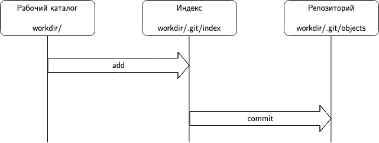
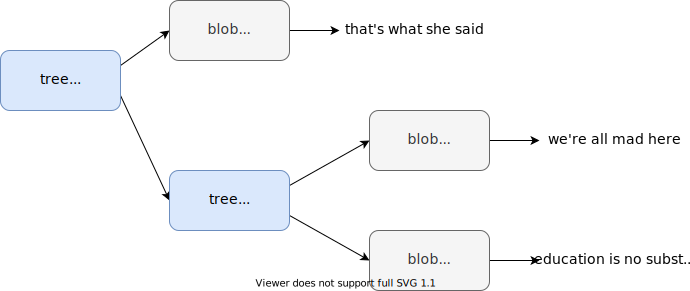
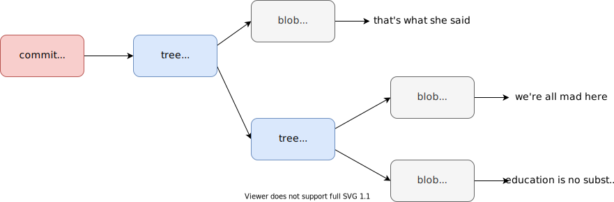
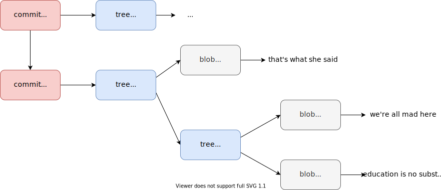
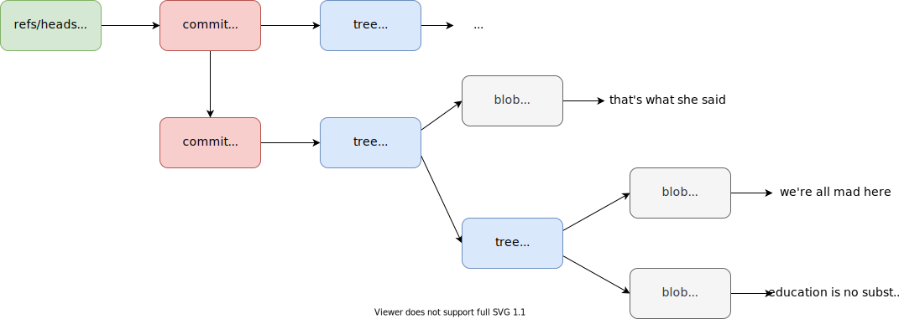
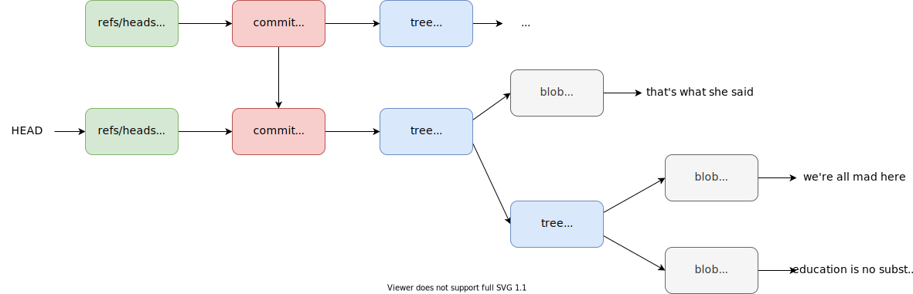

Возможно вы знаете, что [Линус Торвальдс написал Git с нуля](http://git-scm.com/book/en/Getting-Started-A-Short-History-of-Git), а также как сильно он его [любит](http://www.youtube.com/watch?v=MShbP3OpASA#t=2288) (если вам интересна последовательность событий, которая привела к появлению Git, то можно начать с [этого сообщения Линуса в почтовой рассылке ядра Linux](http://lkml.org/lkml/2005/4/6/121)):

> Actually I’m proud of git. I want to say this. The fact that I had to write git was accidental, but Linux, the design came from a great mind, and that great mind was not mine. I mean you have to give credit for the design of Linux to Kernighan and Ritchie and Thompson. I mean there’s a reason I like Unix and I wanted to redo it. I do want to say that git is a design that is mine and unique, and I’m proud of the fact that I can damn well also do good design from scratch.

Но многие начинающие программисты, и не только, ненавидят Git. Им кажется, что Git это какая-то сложная, запутанная система, при использовании которой постоянно возникают какие-то ошибки, да и вообще «Зачем этот Git нужен?». Обычно эта ненависть вызвана простым непониманиме работы Git'а.

Чтобы устранить это непонимание мы напишем свою систему контроля версий PyVCS, реализующую небольшое подмножество команд Git'а.

### Содание репозитория

Вы уже знаете, что выполнение команды `git init` приводит к созданию нового репозитория в указанном каталоге (текущем по умолчанию). Все данные репозитория обычно расположены в каталоге `.git` (имя которого можно изменить через переменную окружения `GIT_DIR`). Давайте попробуем воссоздать минимально необходимую структуру репозитория:

```bash
$ mkdir .git
$ mkdir -p .git/refs/heads
$ mkdir -p .git/refs/tags
$ mkdir -p .git/objects
$ echo "ref: refs/heads/master\n" > .git/HEAD
(master) $ echo "[core]\n\trepositoryformatversion = 0\n\tfilemode = true\n\tbare = false\n\tlogallrefupdates = false\n" >> .git/config
(master) $ echo "Unnamed pyvcs repository" >> .git/description
```

В последующих заданиях будет объяснено назначение каждого созданного каталога и файла, хотя уже должно быть очевидно, что `.git/config` хранит настройки конткретного репозитория, а `.git/description` описание. Подробно со структурой каталога `.git` можно ознакомиться [здесь](https://git-scm.com/docs/gitrepository-layout).

Вашей задачей является автоматизировать этот процесс и реализовать команду `pyvcs init`, которая создает новый пустой репозиторий в указанном каталоге (по умолчанию в текущем). В первую очередь запустите тесты, чтобы понять над какими функциями в этом задании вам предстоит работать:

```sh
$ python -m unittest discover
======================================================================
FAIL: test_cant_create_repo_if_workdir_is_a_file (tests.test_repo.RepoCreateTestCase)
----------------------------------------------------------------------
...
```

После завершения работы над соответствующими функциями выполните следующую команду для установки пакета в вашем виртуальном окружении:

```sh 
$ pip install -e .
```

Пример использования:

```sh
$ mkdir workdir && cd $_
$ pyvcs init
$ tree .git
.git
├── HEAD
├── config
├── description
├── objects/
└── refs/
    ├── heads
    └── tags
$ GIT_DIR=.pyvcs pyvcs init new_workdir
$ tree new_workdir/.pyvcs
.pyvcs
├── HEAD
├── config
├── description
├── objects/
└── refs/
    ├── heads
    └── tags
```

### Хранение файлов

Разберемся с тем как Git хранит ваши данные. Git является [контентно-адресуемым хранилищем данных](https://ru.wikipedia.org/wiki/%D0%9A%D0%BE%D0%BD%D1%82%D0%B5%D0%BD%D1%82%D0%BD%D0%BE-%D0%B0%D0%B4%D1%80%D0%B5%D1%81%D1%83%D0%B5%D0%BC%D0%BE%D0%B5_%D1%85%D1%80%D0%B0%D0%BD%D0%B8%D0%BB%D0%B8%D1%89%D0%B5_%D0%B4%D0%B0%D0%BD%D0%BD%D1%8B%D1%85), другими словами, Git представляет собой хранилище по типу ключ-значение. Ключом выступает хеш посчитанный от данных, а значением сами данные. Итак, когда вы добавляете новый файл в репозиторий, то от содержимого файла считается хеш-сумма по алгоритму [SHA-1](https://ru.wikipedia.org/wiki/SHA-1), два первых символа которой становятся именем директории в каталоге `objects`, а остальные символы именем файла, чье содержимое записывается в сжатом виде с помощью библиотеки [zlib](https://ru.wikipedia.org/wiki/Zlib) и называется блобом (blob, binary large object). Рассмотрим простой пример:

```sh
$ echo -n "that's what she said" > quote.txt
$ git hash-object quote.txt
7e774cf533c51803125d4659f3488bd9dffc41a6
$ tree .git
# No changes
$ git hash-object -w quote.txt
7e774cf533c51803125d4659f3488bd9dffc41a6
$ tree .git
.git
├── objects
│   └── 7e
│       └── 774cf533c51803125d4659f3488bd9dffc41a6
...
$ xxd .git/objects/7e/774cf533c51803125d4659f3488bd9dffc41a6
00000000: 7801 4bca c94f 5230 3260 28c9 482c 512f  x.K..OR02`(.H,Q/
00000010: 5628 0752 0ac5 19a9 0ac5 8999 2900 833a  V(.R........)..:
00000020: 0962                                     .b
```

Еще раз отметим, что Git является контентно-адресуемым хранилищем, таким образом, если у нас будет два файла с одинаковым содержимым, то у них будет одинаковый идентификатор (ключ), а соответственно их содержимое будет представлено одним и тем же блобом:

```sh
$ cp quote.txt quote_copy.txt
$ git hash-object -w quote_copy.txt
7e774cf533c51803125d4659f3488bd9dffc41a6
$ tree .git
# No changes
```

Давайте самостоятельно попробуем посчитать хеш-сумму и сжать содержимое цитаты из примера:

```python
>>> import hashlib
>>> import zlib
>>> content = "that's what she said"
>>> header = f"blob {len(content)}\0"
>>> store = header + content
>>> hashlib.sha1(store.encode()).hexdigest()
'7e774cf533c51803125d4659f3488bd9dffc41a6'
>>> zlib.compress(store.encode())
b'x\x9cK\xca\xc9OR02`(\xc9H,Q/V(\x07R\n\xc5\x19\xa9\n\xc5\x89\x99)\x00\x83:\tb'
>>> zlib.compress(store.encode()).hex()
'789c4bcac94f5230326028c9482c512f562807520ac519a90ac589992900833a0962'
```

Отметим, что данные добавляются к заголовоку, который состоит из типа (существует 4 типа [объектов](https://git-scm.com/book/en/v2/Git-Internals-Git-Objects): блобы, коммиты, деревья и теги) и длины записываемых данных.

Вы могли заметить, что отличаются первые два байта в шестнадцатеричном представлении сжатых данных (7801 и 789с), это связано с использованием разных уровней сжатия (изменить уровень сжатия можно в файле конфигурации указав значение переменной `core.compression`):

1. 78 01 - No Compression/low
2. 78 9C - Default Compression
3. 78 DA - Best Compression

Вашей задачей является реализовать команду `pyvcs hash-object` с поддержкой флага на запись `-w`. Для запуска тестов измените версию пакета в файле `pyvcs/__init__.py` на 0.2.0.

### Восстановление файлов

Мы научились создавать блобы, чтобы вывести их содержимое Git предоставляет команду `cat-file` (флаг `-p` означает `pretty`, то есть, понятный вывод содержимого объекта):

```bash
$ git cat-file -p 7e774cf533c51803125d4659f3488bd9dffc41a6
that's what she said
```

С ее помощью мы можем легко восстанавливать содержимое файлов, если они были удалены:

```sh
$ rm quote.txt
$ git cat-file -p 7e774cf533c51803125d4659f3488bd9dffc41a6 > quote.txt
$ cat quote.txt
that's what she said
```

Работа этой команды зеркальна по отношению к `hash-object`, мы должны разобрать заголовок и вывести содержимое:

```python
>>> import zlib
>>> path = ".git/objects/7e/774cf533c51803125d4659f3488bd9dffc41a6"
>>> with open(path, mode="rb") as f:
...     obj_data = zlib.decompress(f.read())
>>> obj_data
b"blob 20\x00that's what she said"
>>> obj_data.find(b"\x00")
7
>>> header = obj_data[:7]
>>> header.find(b" ")
4
>>> header[:4]
b'blob'
>>> content_len = int(header[4:7].decode("ascii"))
>>> content_len
20
>>> content = obj_data[8:]
>>> content
b"that's what she said"
>>> assert content_len == len(content)
```

Вашей задачей является реализовать команду `pyvcs cat-file` с поддержкой флага  `-p`. Для корректной работы cat-file вам также потребуется реализовать ряд вспомогательных функций. Также не забудьте изменить версию пакета на 0.3.0 для запуска тестов.

### Добавление в индекс

Индекс (index) или область подготовленных файлов (staging area) является временным «снимком» текущего состояния вашего репозитория, то есть, содержит те изменения, которые вы собираетесь включить в коммит. Таким образом, вы делаете коммит содержимого индекса, а не вашей рабочей директории:



Добавить файл в индекс можно с помощью команды `update-index`, более дружелюбной версией которой является команда `add`, а просмотреть состояние индекса с помощью команд `ls-files` или `status`:

```sh
$ git ls-files
$ git update-index --add quote.txt
$ git ls-files
quote.txt
```

Индекс является бинарным файлом и имеет [следующий формат](https://github.com/git/git/blob/master/Documentation/technical/index-format.txt):

```
DIRC <номер версии> <число записей>
<множество записей>
<расширения>
<sha>
```

Для простоты будем использовать вторую версию без расширений. Каждая запись имеет следующий формат:

```
<ctime  (4 байта) время последнего изменения в секундах>
<ctime  (4 байта) время последнего изменения в наносекундах>
<mtime  (4 байта) время последней модификации в секундах>
<mtime  (4 байта) время последней модификации в наносекундах>
<dev    (4 байта) ID устройства с файлом>
<ino    (4 байта) номер inode>
<mode   (4 байта) права доступа>
<uid    (4 байта) ID пользователя-владельца>
<gid    (4 байта) ID группы-владельца>
<size   (4 байта) полный размер в байтах>
<SHA>   (20 байт)
<flags> (2 байта)
<name путь к файлу>
```

Чтобы определить, был ли изменен файл, Git сравнивает его текущее состояние, хеш и имя с сохраненными в индексе, если они совпадают, то файл считается без изменений.

Получить состояние файла можно с помощью фунции `stat` из модуля `os`:

```python
>>> import os
>>> os.stat("quote.txt")
os.stat_result(
  st_mode=33188,
  st_ino=12893151331,
  st_dev=16777220,
  st_nlink=1,
  st_uid=501,
  st_gid=20,
  st_size=20,
  st_atime=1593372717,
  st_mtime=1592504683,
  st_ctime=1592504683
)
```

Для простоты будем полагать время последнего изменения и модификации в наносекундах равными 0. Также следует обратить внимание, что под inode (уникальный идентификатор файла) выделено 4 байта, хотя даже в нашем примере этого недостаточно.

Для упаковки и распаковки бинарных данных удобно использовать модуль [struct](https://docs.python.org/3/library/struct.html):

```python
>>> import struct
>>> values = (1, b"abc", 1.234)
>>> packed = struct.pack("L3sd", *values)
>>> packed
b'\x01\x00\x00\x00\x00\x00\x00\x00abc\x00\x00\x00\x00\x00X9\xb4\xc8v\xbe\xf3?'
>>> struct.unpack("L3sd", packed)
(1, b'abc', 1.234)
```

От вас требуется реализовать команды `update-index` с обязательным параметром `--add` и `ls-files` с опциональным флагом `-s`. Для запуска тестов измените версию пакета на 0.4.0.

### Сохранение индекса

Для сохранения текущего состояния индекса используется команда `write-tree`:

```sh
$ git write-tree
744e098ade17d10da8af62dc49651813a5509ff2
```

В результате мы получили новый объект, который можем просмотреть с помощью команды `cat-file`:

```sh
$ git cat-file -p 744e098ade17d10da8af62dc49651813a5509ff2
100644 blob 7e774cf533c51803125d4659f3488bd9dffc41a6	quote.txt
```

Где:

- 100644 - права доступа на файл (если вы впервые столкнулись с концепцией прав, то почитайте [вот эту статью](https://help.ubuntu.ru/wiki/%D1%81%D1%82%D0%B0%D0%BD%D0%B4%D0%B0%D1%80%D1%82%D0%BD%D1%8B%D0%B5_%D0%BF%D1%80%D0%B0%D0%B2%D0%B0_unix)). Git различает только 644 (не исполняемый) и 755 (исполняемый);
- blob - тип объекта (blob, tree, commit, tag);
- 7e774...a6 - идентификатор объекта;
- quote.txt - имя файла.

Этой информации должно быть достаточно, чтобы восстановить файл: мы знаем его имя, содержимое и является ли он исполняемым.

```sh
$ git cat-file -t 7e774
blob
$ git cat-file -t 744e0
tree
```

Итак, блоб хранит содержимое файла, но не «знает» ни имени, ни прав. В свою очередь tree-объекты хранят имя и права.

Давайте рассмотрим пример с созданием директорий:

```sh
$ mkdir books
$ echo -n "we're all mad here" > books/alice_in_wonderland.txt
$ echo -n "education is no substitute for intelligence" > books/dune.txt
$ git update-index --add books/alice_in_wonderland.txt
$ git update-index --add books/dune.txt
$ git write-tree
0c30406df9aea54b7fd6b48360417e59ab7ab9bb
$ git cat-file -p 0c3040
040000 tree 4af0c4c4c21f8b566e6ae9895b4881f085df9609	books
100644 blob 7e774cf533c51803125d4659f3488bd9dffc41a6	quote.txt
$ git cat-file -p 4af0c
100644 blob 725f42e3e23df4ca4559d727079d017e82092eb9	alice_in_wonderland.txt
100644 blob e40c3e78d02c21c1a449c301364f4eaba47eb2d7	dune.txt
```

Блобы и tree-объекты можно сравнить со структурой файловой системы - блобы это файлы, а tree - каталоги.



Вашей задачей является реалиовать команду `write-tree` для сохранения индекса и создания tree-объекта.

### Создание коммитов

Мы научились создавать tree-объекты, которые являются снимками состояния вашего рабочего каталога. Не хватает информации о том, почему этот снимок был сделан. Мы можем добавить эту информацию с помощью команды `commit-tree`:

```sh
$ echo "initial commit" | git commit-tree 0c30406df9aea54b7fd6b48360417e59ab7ab9bb
409bb5da633819f577897d677221ed94013e91f1
$ git cat-file -t 409bb5da633819f577897d677221ed94013e91f1
commit
$ git cat-file -p 409bb5da633819f577897d677221ed94013e91f1
tree 0c30406df9aea54b7fd6b48360417e59ab7ab9bb
author Dementiy <Dementiy@yandex.ru> 1595190048 +0300
committer Dementiy <Dementiy@yandex.ru> 1595190048 +0300

initial commit
```

Мы создали коммит, который включает ссылку на tree-объект, автора и коммитера (имя, адрес электронной почты и [Unix timestamp](https://ru.wikipedia.org/wiki/Unix-%D0%B2%D1%80%D0%B5%D0%BC%D1%8F)) и описание коммита. Найти описание разницы между автором и коммитером можно [тут](https://git-scm.com/book/en/v2/Git-Basics-Viewing-the-Commit-History):

> You may be wondering what the difference is between *author* and *committer*. The author is the person who originally wrote the work, whereas the committer is the person who last applied the work. So, if you send in a patch to a project and one of the core members applies the patch, both of you get credit — you as the author, and the core member as the committer.




Давайте добавим еще один файл и создадим новый коммит, таким образом, у нас образуется история изменений:

```sh
$ echo -n "wake up, time to die\!" > movies/blade_runner.txt
$ git update-index --add movies/blade_runner.txt
$ git write-tree
8cc7b9822afeae4e5afc534ee4e52c0b962b012a
$ echo "Add movies folder" | git commit-tree 8cc7b9822afeae4e5afc534ee4e52c0b962b012a -p 409bb5da633819f577897d677221ed94013e91f1
0de19ef9f14a75e8612abb17b9623cbb51c833ac
$ git cat-file -p 0de19ef9f14a75e8612abb17b9623cbb51c833ac
tree 8cc7b9822afeae4e5afc534ee4e52c0b962b012a
parent 409bb5da633819f577897d677221ed94013e91f1
author Dementiy <Dementiy@yandex.ru> 1595190109 +0300
committer Dementiy <Dementiy@yandex.ru> 1595190109 +0300

Add movies folder
```

Единственным изменением по сравнению с предыдущей командой является указателя родительского коммита с помощью флага `-p` (parent):



История изменений можно отобразить с помощью команды `log`:

```sh
$ git log 0de19ef9f14a75e8612abb17b9623cbb51c833ac
commit 0de19ef9f14a75e8612abb17b9623cbb51c833ac
Author: Dementiy <Dementiy@yandex.ru>
Date:   Sun Jul 19 23:21:49 2020 +0300

    Add movies folder

commit 409bb5da633819f577897d677221ed94013e91f1
Author: Dementiy <Dementiy@yandex.ru>
Date:   Sun Jul 19 23:20:48 2020 +0300

    initial commit
```

Вашей задачей является реализовать команду `commit-tree`.

### Создание ссылок и веток

Мы разобрались с назначением `.git/objects`, давайте теперь разберемся с назначением `.git/refs`. В этом каталоге есть два подкаталога `heads` и `tags`. Первый хранит ссылки на ветки, которые можно создать с помощью команды `update-ref`:

```sh
$ ls .git/refs/heads
# No existing files
$ git branch
# No existing branches
$ git update-ref refs/heads/master 0de19ef9f14a75e8612abb17b9623cbb51c833ac
$ ls .git/refs/heads
master
$ cat .git/refs/heads/master 
0de19ef9f14a75e8612abb17b9623cbb51c833ac
$ git branch
* master
$ git cat-file -p master
# ...
$ git rev-parse master
0de19ef9f14a75e8612abb17b9623cbb51c833ac
```

Итак, мы создали ссылку на коммит `0de19...ac` с именем `master` (ветку `master`!) и можем использовать ее вместо идентификатора коммита, например, в командах `cat-file` или `log`.

 

```sh
$ echo -n "somebody is up to something" > movies/isle_of_dogs.txt
$ git update-index --add movies/isle_of_dogs.txt
$ git write-tree
de76840e3154c1af9f61ca8a165933c321610840
$ echo "Add isle_of_dogs.txt" | git commit-tree de76840e3154c1af9f61ca8a165933c321610840 -p master
14c417307d5c953382a14e764614dd774f30ab22
$ git log --oneline 14c417307d5c953382a14e764614dd774f30ab22
14c4173 Add isle_of_dogs.txt
0de19ef Add movies folder
409bb5d initial commit
```

Если мы попробуем просмотреть историю указав ветку `master`, то не увидим всей истории:

```sh
$ git log --oneline master
0de19ef Add movies folder
409bb5d initial commit
```

Нам необходимо вручную обновить сслыку на мастер-ветку:

```sh
$ git update-ref refs/heads/master 14c417307d5c953382a14e764614dd774f30ab22
$ git log --oneline master
14c4173 Add isle_of_dogs.txt
0de19ef Add movies folder
409bb5d initial commit
```

Давайте создадим еще одну ветку:

```sh
$ git update-ref refs/heads/dev 0de19ef9f14a75e8612abb17b9623cbb51c833ac
$ ls .git/refs/heads 
dev    master
$ git branch
  dev
* master
```

Обратите внимание, что мы находимся на мастер-ветке. Текущая ветка (положение в истории) определяется содержимым `HEAD`:

```sh
$ cat .git/HEAD
ref: refs/heads/master
```

С помощью команды `symbolic-ref` мы можем сделать текущей ветку `dev`:

```sh
$ git symbolic-ref HEAD refs/heads/dev
$ cat .git/HEAD
ref: refs/heads/dev
$ git branch
* dev
  master
$ git cat-file -p HEAD
tree 8cc7b9822afeae4e5afc534ee4e52c0b962b012a
parent 409bb5da633819f577897d677221ed94013e91f1
author Dementiy <Dementiy@yandex.ru> 1595190109 +0300
committer Dementiy <Dementiy@yandex.ru> 1595190109 +0300

Add movies folder
```



Вашей задачей является реализация команд `update-ref`, `rev-parse`, `symbolic-ref`, `commit`.
