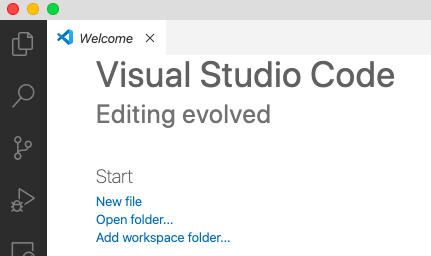
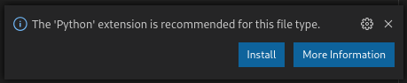
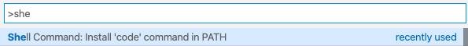

В этой работе мы познакомимся с основными инструментами необходимыми для выполнения практических заданий. Вполне естественно, что время от времени эта работа будет обновляться - появляются новые инструменты, меняется «workflow», так что следите за изменениями и задавайте вопросы, если что-то непонятно.

## Установка интерпретатора Python

В первую очередь нам понадобится [интерпретатор](https://en.wikipedia.org/wiki/Interpreter_(computing)) языка Python[^1]. На операционных системах с ядром Linux (Ubuntu, Fedora и др.) интерпретатор Python скорее всего уже установлен, но его потребуется обновить до более новой версии (текущая стабильная версия 3.8, а в октябре 2020 [ожидается](https://www.python.org/dev/peps/pep-0596/) 3.9). У пользователей MacOS интерпретатор Python также скорее всего установлен, но в скором времени Apple [откажется](https://developer.apple.com/documentation/macos_release_notes/macos_catalina_10_15_beta_release_notes) от предустановленных скриптовых языков. Если интерпретатор не установлен, то вы можете его установить с помощью пакетного менеджера [Homebrew](https://brew.sh/). Для пользователей операционной системы Windows есть два пути: скачать интерпретатор с официального [сайта](https://www.python.org/downloads/) или установить из [Windows Store](https://devblogs.microsoft.com/python/python-in-the-windows-10-may-2019-update/). Если вы решили установить Python с официального сайта, то обязательно во время установки выберите пункт добавления пути к интерпретатору в переменную окружения `PATH` (если по какой-либо причине вы не сделали этого, то обратитесь к [официальному руководству](https://docs.python.org/3/using/windows.html#configuring-python)).

После установки проверьте версию интерпретатора (она должна быть 3.8 и выше), для этого откройте терминал (командную строку) и выполните следующую команду:

```sh
$ python --version
Python 3.8.2
```

!!! info
    Знак доллара `$` обозначает приглашение к вводу команд. В Windows такое приглашение обычно выглядит как символ больше `>`.

!!! tip
    Если вы работаете с ОС Windows, то для более комфортной работы рекомендуется установить набор инструментов [Git For Windows](https://git-for-windows.github.io/) или [WSL](https://docs.microsoft.com/ru-ru/windows/wsl/).

В какой-то момент вам может потребоваться установить более свежую версию интерпретатора или вы будете работать над несколькими проектами, в которых будут использоваться разные версии. Для этих целей существует менеджер версий [pyenv](https://github.com/pyenv/pyenv). Для установки на *nix системах можно воспользоваться [pyenv-installer](https://github.com/pyenv/pyenv-installer) (пользователям Windows следует воспользоваться [pyenv-win](https://github.com/pyenv-win/pyenv-win#installation)):

```sh
$ curl https://pyenv.run | bash
```

После установки будет предложено добавить следующие строки в ваш `.bashrc` для автоматического обнаружения pyenv:

```sh
export PATH="/путь/к/.pyenv/bin:$PATH"
eval "$(pyenv init -)"
eval "$(pyenv virtualenv-init -)"
```

И затем выполните следующую команду:

```sh
$ . ~/.bashrc
```

Чтобы просмотреть список версий установленных на вашей системе:

```shell
$ pyenv versions
* system (set by /Users/dementiy/.pyenv/version)
```

Чтобы просмотреть список доступных версий интерпретатора:

```shell
$ pyenv install --list | grep "^\s+3\.[89]"
  3.8.0
  3.8-dev
  3.8.1
  ...
  3.9-dev
```

Для установки конкретной версии выполните следующую команду:

```bash
$ pyenv install 3.8.5
$ pyenv versions
* system (set by /Users/dementiy/.pyenv/version)
  3.8.5
```

Чтобы изменить используемую версию:

```shell
$ pyenv global 3.8.5
$ python --version
Python 3.8.5
```

Для более полного знакомства с менеджером версий pyenv можете почитать [эту](https://realpython.com/intro-to-pyenv/) статью.

## Работа с виртуальными окружениями

Для выполнения работ мы будем использовать стандартный модуль [`venv`](https://docs.python.org/3/library/venv.html), появившийся с версии 3.3 и предназначенный для создания и управления изолированными (виртуальными) окружениями. `venv` позволяет заключить в отдельный каталог необходимые версии python-пакетов и использовать только их. Используя `venv`, вы можете устанавливать свежие версии пакетов из [Python Package Index](https://pypi.python.org/pypi), при этом не получая проблем с совместимостью версий загруженных пакетов и тех, что уже имеются в системе.

Создадим отдельный каталог `~/.virtualenvs` (некоторые редакторы, например, [VSCode](https://code.visualstudio.com/), по умолчанию полагаются именно на такое название и расположение каталога при поиске доступных интерпретаторов) для виртуальных окружений и новое окружение с именем `cs102`:

```sh
$ mkdir ~/.virtualenvs
$ python -m venv ~/.virtualenvs/cs102
$ which python
/usr/local/bin/python
$ source ~/.virtualenvs/cs102/bin/activate
(cs102) $ which python
/Users/dementiy/.virtualenvs/cs102/bin/python
(cs102) $ deactivate
$ which python
/usr/local/bin/python
```

Для быстрого переключения на нужное виртуальное окружение рекомендуется добавить следующую функцию в ваш `~/.bashrc` (это сценарий, который запускается всякий раз, когда начинается новый сеанс терминала в интерактивном режиме; выполните затем команду `. ~/.bashrc`, чтобы функция стала доступна в текущем сеансе):

```sh
function workon() {
  if test -z "$1" ; then
    echo "Specify the name of the virtual environment"
  elif test ! -f "$HOME/.virtualenvs/$1/bin/activate" ; then
    echo "Environment doesn't exists"
  else
    deactivate 2> /dev/null
    source "$HOME/.virtualenvs/$1/bin/activate"
  fi
}
```

Для примера в созданном виртуальном окружении установим следующие пакеты: [black](https://github.com/psf/black) (для автоматического форматирования кода), [isort](https://github.com/timothycrosley/isort) (для сортировки импортов, т.е., имен подключаемых модулей), [mypy](http://mypy-lang.org/) (для проверки типов) и [pylint](https://www.pylint.org/) (статический анализатор кода для выявления потенциальных проблем):

```sh
$ workon cs102
(cs102) $ python -m pip install black isort mypy pylint
(cs102) $ pip freeze
```

В этом примере мы использовали [pip](https://docs.python.org/3.5/installing/index.html) для установки новых пакетов. Иногда устанавливаемый пакет требует наличие других пакетов для своей работы, обычно эти пакеты устанавливаются автоматически (говорят «по зависимостям»). Но может возникнуть ситуация, когда вам придется вручную установить нужную библиотеку. Если вы не знаете как это сделать, то поищите ответ на [stackoverflow.com](http://stackoverflow.com), скорее всего кто-то уже столкнулся с той же проблемой, что и вы.

## Система контроля версий

Мы будем пользоваться системой контроля версий (что такое контроль версий и зачем он вам нужен можно почитать [тут](http://practical-neuroimaging.github.io/git_parable.html) и [тут](https://git-scm.com/book/ru/v1/Введение-О-контроле-версий)). Все изменения, которые будут происходить с вашими работами, могут храниться локально (у вас на компьютере), а могут и удаленно, так, что вы всегда сможете продолжить работу над своим проектом. Поэтому вам нужно зарегистрироваться либо на [https://github.com](https://github.com), либо на [https://bitbucket.org](https://bitbucket.org/) (а можно и там и там). На случай, если вы хотите ограничить доступ к вашей кодовой базе, то на bitbucket есть возможность создания бесплатного приватного репозитория, а github предоставляет для студентов и преподавателей [Github Education Pack](https://education.github.com/).

Для всех практических работ вам предоставлены шаблоны и тесты, которые располжены в [репозитории курса](https://github.com/Dementiy/pybook-assignments). На основе репозитория курса вы можете создать свой репозиторий, для этого зарегистрируйтесь на [Github'е](https://github.com), перейдите на страницу репозитория курса и нажмите на `Use this template`:


Укажите название и описание репозитория, а затем нажмите на `Create repository from template`:


По шаблону репозитория курса был создан новый репозиторий, который теперь принадлежит вам. Его необходимо клонировать (создать локальную копию репозитория):

```sh
$ git clone https://github.com/Dementiy/cs102.git
Cloning into '.'...
remote: Enumerating objects: 93, done.
remote: Counting objects: 100% (93/93), done.
remote: Compressing objects: 100% (90/90), done.
remote: Total 93 (delta 9), reused 0 (delta 0), pack-reused 0
Unpacking objects: 100% (93/93), done.
$ ls
README.md homework01 homework01-go homework02 homework02-go ...
```

!!! note
    Если после выполнения команды `git clone` вы получили сообщение об ошибке о том, что команда `git` не найдена, то, скорее всего, вы работаете под Windows и `git` нужно [установить](https://git-for-windows.github.io/).

После выполнения команды `git clone` будет создан каталог с именем `cs102`. Для быстрого перехода в этот каталог добавим alias в ваш `.bashrc`, для этого откройте терминал и выполните следующие команды.

```sh
$ echo 'alias gocs102="cd /путь/к/каталогу/cs102"' >> ~/.bashrc
$ . ~/.bashrc
$ gocs102
$ pwd
/путь/к/каталогу/cs102
```

## Выбор редактора кода

Вам будет нужен редактор кода. Это может быть «простой» текстовый редактор с подсветкой синтаксиса и дополнительно устанавливаемыми расширениями, например, [VSCode](https://code.visualstudio.com/), [Vim](http://www.vim.org/), [Atom](https://atom.io/), [SublimeText](https://www.sublimetext.com/)  или же полноценная среда разработки [PyCharm](https://www.jetbrains.com/pycharm/download/). Рекомендуется попробовать разные редакторы (мы рассмотрим настройку [VSCode](https://code.visualstudio.com/)), потратив некоторое время на ознакомление с их возможностями и чтение документации.

!!! info
    Достаточно часто университеты покупают программное обеспечение для своих студентов на время обучения. Например, Университет ИТМО имеет лицензии на все продукты компании JetBrains.

Запустите VSCode, выберите `Open Folder` и укажите каталог `cs102`:



После чего на вкладке `Explorer` появится содержимое шаблонов всех работ. Создайте в корне новый файл с именем `hello.py` и следующим содержимым:

```python
def main() -> None:
    print("Hello, World!")


if __name__ == "__main__":
    main()
```

VSCode предложит установить расширение для Python (вы можете установить его самостоятельно, нажав на левой панели на `Extensions` и в поисковой строке набрав `python`):



После установки расширения вы сможете запускать и отлаживать код непосредственно в VSCode. Также в репозотирии есть базовые настройки для пакетов, которые вы установили раннее (black, isort, pylint, mypy). Настройки можно найти в файле `.vscode/settings.json`. В настройках по умолчанию указан шрифт [Fira Code](https://github.com/tonsky/FiraCode), вы можете продолжить использовать его или установить любой другой моноширный шрифт ([JetBrains Mono](https://www.jetbrains.com/ru-ru/lp/mono/), [Iosevka](https://github.com/be5invis/Iosevka), [Anonymous Pro](https://fonts.google.com/specimen/Anonymous+Pro) и т.д.).

Также рекомендуется добавить команду `code` для запуска из терминала:



## Задание

Откройте файл с именем `README.md` и добавьте ваши фамилию, имя и номер группы. `README.md` должен быть в формате Markdown, про который можно почитать [тут](https://github.com/OlgaVlasova/markdown-doc/blob/master/README.md).

!!! info
    VSCode позволяет открыть предпросмотр файла в формате Markdown.

Все вопросы и замечания пишите в комментариях или в Slack'е ([что такое Slack?](https://get.slack.help/hc/en-us/articles/115004071768-What-is-Slack-)).

[^1]:
    A также компилятор языка Golang, если вы захотите выполнять практические задания на двух языках. Установка компилятора Golang останется в качестве самостоятельного задания (официальное руководство по установке можно найти [тут](https://golang.org/doc/install))
