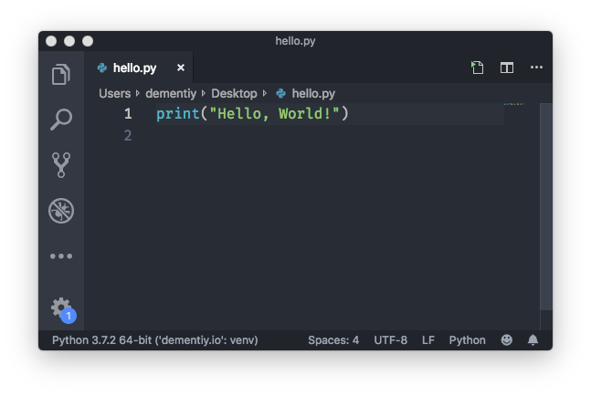
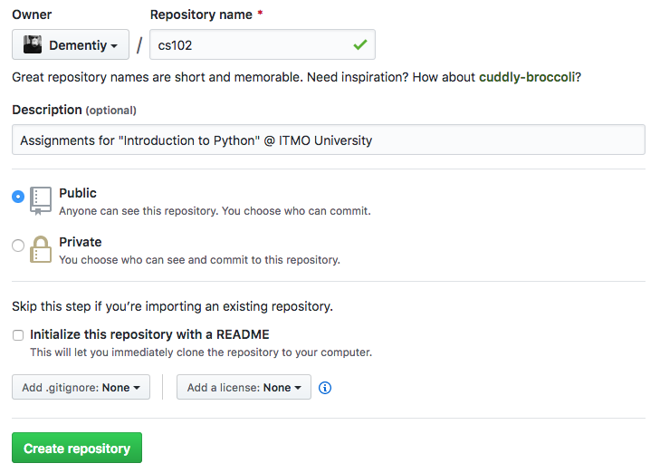

В этой работе мы познакомимся с основными инструментами необходимыми для выполнения практических заданий. Вполне естественно, что время от времени эта работа будет обновляться - появляются новые инструменты, меняется «workflow», так что следите за изменениями и задавайте вопросы, если что-то непонятно.

## Установка интерпретатора Python

В первую очередь нам понадобится [интерпретатор](https://en.wikipedia.org/wiki/Interpreter_(computing)) языка Python[^1]. На операционных системах с ядром Linux (Ubuntu, Fedora и др.) интерпретатор Python скорее всего уже установлен, но его потребуется обновить до более новой версии (текущая стабильная версия 3.7, а к концу 2019 [ожидается](https://www.python.org/dev/peps/pep-0569/) 3.8). У пользователей MacOS интерпретатор Python также скорее всего установлен, но в скором времени Apple [откажется](https://developer.apple.com/documentation/macos_release_notes/macos_catalina_10_15_beta_release_notes) от предустановленных скриптовых языков. Если интерпретатор не установлен, то вы можете его установить с помощью пакетного менеджера [Homebrew](https://brew.sh/). Для пользователей операционной системы Windows есть два пути: скачать интерпретатор с официального [сайта](https://www.python.org/downloads/) или установить из [Windows Store](https://devblogs.microsoft.com/python/python-in-the-windows-10-may-2019-update/). Если вы решили установить Python с официального сайта, то обязательно во время установки выберите пункт добавления пути к интерпретатору в переменную окружения `PATH` (если по какой-либо причине вы не сделали этого, то обратитесь к [официальному руководству](https://docs.python.org/3/using/windows.html#configuring-python)).

После установки проверьте версию интерпретатора (она должна быть 3.7 и выше), для этого откройте терминал (командную строку) и наберите команду `python --version`:

<div class="window">
  <div class="window-titlebar">
    <span class="window-buttons">
      <span class="window-button window-button-close"></span>
      <span class="window-button window-button-hide"></span>
      <span class="window-button window-button-full"></span>
    </span>
    <span class="window-title">Terminal</span>
  </div>
  <div class="window-content">
    <ol class="code">
      <li class="line">$ <b>python</b> --version</li>
      <li class="line">Python 3.7.2</li>
    </ol>
  </div>
</div>


!!! note
    Знак доллара `$` обозначает приглашение к вводу команд. В Windows такое приглашение обычно выглядит как символ больше `>`.

## Выбор редактора кода

Вам будет нужен редактор кода. Это может быть «простой» текстовый редактор с подсветкой синтаксиса и дополнительно устанавливаемыми расширениями, например, [VSCode](https://code.visualstudio.com/), [Atom](https://atom.io/), [SublimeText](https://www.sublimetext.com/)  или же полноценная среда разработки [PyCharm](https://www.jetbrains.com/pycharm/download/) (одним из решений, которыми я пользуюсь, является связка из редактора [Vim](http://www.vim.org/) с разными плагинами и интересного, на мой взгляд, проекта [Kite](https://kite.com/)). Я вам рекомендую попробовать разные редакторы, потратив некоторое время на ознакомление с их возможностями и чтение документации.

Для ваших работ заведите себе отдельный каталог, назовите его `cs102` (так исторически сложилось, можете назвать иначе). В этом каталоге создайте новый файл с именем `hello.py`, откройте его с помощью выбранного редактора кода:




Если вы работаете с ОС Windows, то для более комфортной работы рекомендуется установить набор инструментов [Git For Windows](https://git-for-windows.github.io/). Запустите терминал и создайте файл `.bashrc` (это сценарий, который запускается всякий раз, когда начинается новый сеанс терминала в интерактивном режиме):

<div class="window">
  <div class="window-titlebar">
    <span class="window-buttons">
      <span class="window-button window-button-close"></span>
      <span class="window-button window-button-hide"></span>
      <span class="window-button window-button-full"></span>
    </span>
    <span class="window-title">Terminal</span>
  </div>
  <div class="window-content">
    <ol class="code">
      <li class="line">$ <b>echo</b> 'alias gocs102="cd /путь/к/каталогу/cs102"' >> ~/.bashrc</li>
      <li class="line">$ <b>.</b> ~/.bashrc</li>
      <li class="line">$ <b>gocs102</b></li>
      <li class="line">$ <b>python3</b> hello_world.py</li>
      <li class="line">Hello, World!</li>
      <li class="line">$</li>
    </ol>
  </div>
</div>

Таким образом, вы написали и запустили простейшую программу (скрипт). Запомните эти шаги.

## Работа с виртуальными окружениями

Для выполнения работ мы будем использовать стандартный модуль [`venv`](https://docs.python.org/3/library/venv.html), появившийся с версии 3.3 и предназначенный для создания и управления изолированными (виртуальными) окружениями. `venv` позволяет заключить в отдельный каталог необходимые версии python-пакетов и использовать только их. Используя `venv`, вы можете устанавливать свежие версии пакетов из [Python Package Index](https://pypi.python.org/pypi), при этом не получая проблем с совместимостью версий загруженных пакетов и тех, что уже имеются в системе.

Создадим отдельный каталог `~/.virtualenvs` (некоторые редакторы, например, [VSCode](https://code.visualstudio.com/), по умолчанию полагаются именно на такое название и расположение каталога при поиске доступных интерпретаторов) для виртуальных окружений и новое окружение с именем `cs102`:

<div class="window">
  <div class="window-titlebar">
    <span class="window-buttons">
      <span class="window-button window-button-close"></span>
      <span class="window-button window-button-hide"></span>
      <span class="window-button window-button-full"></span>
    </span>
    <span class="window-title">Terminal</span>
  </div>
  <div class="window-content">
    <ol class="code">
      <li class="line">$ <b>mkdir</b> ~/.virtualenvs</li>
      <li class="line">$ <b>python3</b> -m venv ~/.virtualenvs/cs102</li>
      <li class="line">$ <b>which</b> python3</li>
      <li class="line">/Library/Frameworks/Python.framework/Versions/3.7/bin/python3</li>
      <li class="line">$ <b>source</b> ~/.virtualenvs/cs102/bin/activate</li>
      <li class="line"><b style='color: purple'>(cs102)</b> $ <b>which</b> python</li>
      <li class="line">/Users/dementiy/.virtualenvs/cs102/bin/python</li>
      <li class="line"><b style='color: purple'>(cs102)</b> $ <b>deactivate</b></li>
      <li class="line">$ <b>which</b> python3</li>
      <li class="line">/Library/Frameworks/Python.framework/Versions/3.7/bin/python3</li>
    </ol>
  </div>
</div>


Для быстрого переключения на нужное виртуальное окружение рекомендуется добавить следующую функцию в ваш `~/.bashrc` (выполните затем команду `. ~/.bashrc`, чтобы функция стала доступна в текущем сеансе):

```sh
function workon() {
  if test -z "$1" ; then
    echo "Specify the name of the virtual environment"
  elif test ! -f "$HOME/.virtualenvs/$1/bin/activate" ; then
    echo "Environment doesn't exists"
  else
    deactivate 2> /dev/null
    source "$HOME/.virtualenvs/$1/bin/activate"
  fi
}
```

Для примера в созданном виртуальном окружении установим пакет [jupyter](https://jupyter.org/), с которым поставляется интерпретатор [ipython](https://ipython.org/), предоставляющий дополнительные функциии, как подсветка синтаксиса, подсказки и др:

<div class="window">
  <div class="window-titlebar">
    <span class="window-buttons">
      <span class="window-button window-button-close"></span>
      <span class="window-button window-button-hide"></span>
      <span class="window-button window-button-full"></span>
    </span>
    <span class="window-title">Terminal</span>
  </div>
  <div class="window-content">
    <ol class="code">
      <li class="line">$ <b>workon</b> cs102</li>
      <li class="line"><b style='color: purple'>(cs102)</b> $ <b>python</b> -m pip install jupyter</li>
      <li class="line"><b style='color: purple'>(cs102)</b> $ <b>ipython</b></li>
      <li class="line">Python 3.7.2 (default, Dec 27 2018, 07:35:45)</li>
      <li class="line">Type 'copyright', 'credits' or 'license' for more information</li>
      <li class="line">IPython 7.5.0 -- An enhanced Interactive Python. Type '?' for help.</li>
      <li class="line"></li>
      <li class="line"><b style='color: green'>In [1]:</b></li>
    </ol>
  </div>
</div>

В этом примере мы использовали [pip](https://docs.python.org/3.5/installing/index.html) для установки новых пакетов. Иногда устанавливаемый пакет требует наличие других пакетов для своей работы, обычно эти пакеты устанавливаются автоматически (говорят «по зависимостям»). Но может возникнуть ситуация, когда вам придется вручную установить нужную библиотеку. Если вы не знаете как это сделать, то поищите ответ на [stackoverflow.com](http://stackoverflow.com), скорее всего кто-то уже столкнулся с той же проблемой, что и вы.

## Система контроля версий

Мы будем пользоваться системой контроля версий (что такое контроль версий и зачем он вам нужен можно почитать [тут](https://git-scm.com/book/ru/v1/Введение-О-контроле-версий)). Все изменения, которые будут происходить с вашими работами, могут храниться локально (у вас на компьютере), а могут и удаленно, так, что вы всегда сможете продолжить работу над своим проектом. Поэтому вам нужно зарегистрироваться либо на [https://github.com](https://github.com), либо на [https://bitbucket.org](https://bitbucket.org/) (а можно и там и там). На случай, если вы хотите ограничить доступ к вашей кодовой базе, то на bitbucket есть возможность создания бесплатного приватного репозитория, а github предоставляет для студентов и преподавателей [Github Education Pack](https://education.github.com/).

Рассмотрим пример создания репозитория на github. Для этого зарегистрируйтесь на сайте [https://github.com](https://github.com),  затем перейдите на вкладку `Repositories` и нажмите на `New`:


Укажите название и описание репозитория и затем нажмите на `Create Repository`:



Достаточно повторить шаги указанные в пункте `…or create a new repository on the command line`, но вместо файла `README.md` мы сделаем коммит (зафиксируем и затем загрузим изменения на сервер) нашей программы `hello.py`:

<div class="window">
  <div class="window-titlebar">
    <span class="window-buttons">
      <span class="window-button window-button-close"></span>
      <span class="window-button window-button-hide"></span>
      <span class="window-button window-button-full"></span>
    </span>
    <span class="window-title">Terminal</span>
  </div>
  <div class="window-content">
    <ol class="code">
      <li class="line">$ <b>gocs102</b></li>
      <li class="line">$ <b>git</b> init</li>
      <li class="line" style="color: gray">Initialized empty Git repository in /Users/dementiy/courses/cs102/.git/</li>
      <li class="line">$ <b>git</b> remote add https://github.com/Dementiy/cs102.git</li>
      <li class="line">$ <b>git</b> add hello.py</li>
      <li class="line">$ <b>git</b> commit -m 'Initial commit with my first program on Python'</li>
      <li class="line" style="color: gray">*** Please tell me who you are.</li>
      <li class="line" style="color: gray">Run</li>
      <li class="line" style="color: gray">git config --global user.email "you@example.com"</li>
      <li class="line" style="color: gray">git config --global user.name "Your Name"</li>
      <li class="line" style="color: gray">to set your account`s default identity.</li>
      <li class="line" style="color: gray">Omit --global to set the identity only in this repository.</li>
      <li class="line" style="color: gray">fatal: unable to auto-detect email address (got 'user@Air-user.(none)')</li>
    </ol>
  </div>
</div>

!!! note
    Если после выполнения команды `git init` вы получили сообщение об ошибке о том, что команда `git` не найдена, то, скорее всего, вы работаете под Windows и `git` нужно [установить](https://git-for-windows.github.io/).

Система контроля версий подсказывает нам, что нужно выполнить предварительную настройку репозитория, указав `user.email` и `user.name`:

<div class="window">
  <div class="window-titlebar">
    <span class="window-buttons">
      <span class="window-button window-button-close"></span>
      <span class="window-button window-button-hide"></span>
      <span class="window-button window-button-full"></span>
    </span>
    <span class="window-title">Terminal</span>
  </div>
  <div class="window-content">
    <ol class="code">
      <li class="line">$ <b>git</b> config --global user.email "Dementiy@yandex.ru"</li>
      <li class="line">$ <b>git</b> config --global user.name "Dmitriy"</li>
      <li class="line">$ <b>git</b> commit -m 'Initial commit with my first program on Python'</li>
      <li class="line" style="color: gray">[master (root-commit) f9463ab] Initial commit with my first program on Python</li>
      <li class="line" style="color: gray">1 file changed, 1 insertion(+)</li>
      <li class="line" style="color: gray">create mode 100644 hello.py</li>
      <li class="line">$ <b>git</b> push -u origin master</li>
      <li class="line" style="color: gray">Counting objects: 3, done.</li>
      <li class="line" style="color: gray">Writing objects: 100% (3/3), 257 bytes | 257.00 KiB/s, done.</li>
      <li class="line" style="color: gray">Total 3 (delta 0), reused 0 (delta 0)</li>
      <li class="line" style="color: gray">To https://github.com/Dementiy/cs102.git</li>
      <li class="line" style="color: gray">* [new branch] master -> master</li>
      <li class="line" style="color: gray">Branch master set up to track remote branch master from origin.</li>
    </ol>
  </div>
</div>


Теперь убедитесь, что новый файл появился на github:


Давайте немного изменим нашу программу `hello.py`, добавив в нее функцию и проверку на то, выполняется ли наша программа как скрипт или она используется как модуль (библиотека, подключаемая в других скриптах):

```python
def message():
    print("Hello, World!")

if __name__ == "__main__":
    message()
```

<div class="window">
  <div class="window-titlebar">
    <span class="window-buttons">
      <span class="window-button window-button-close"></span>
      <span class="window-button window-button-hide"></span>
      <span class="window-button window-button-full"></span>
    </span>
    <span class="window-title">Terminal</span>
  </div>
  <div class="window-content">
    <ol class="code">
      <li class="line">$ <b>workon</b> cs102</li>
      <li class="line"><b style='color: purple'>(cs102)</b> $ <b>python</b> hello.py</li>
      <li class="line">Hello, World!</li>
      <li class="line"><b style='color: purple'>(cs102)</b> $ <b>ipython</b></li>
      <li class="line"><b style='color: green'>In [1]:</b> import hello</li>
      <li class="line"><b style='color: green'>In [2]:</b> hello.message()</li>
      <li class="line">Hello, World!</li>
    </ol>
  </div>
</div>

Итак, мы внесли нужные изменения в программу, `git` эти изменения также заметил. Проверить это можно с помощью команды `git status`:

<div class="window">
  <div class="window-titlebar">
    <span class="window-buttons">
      <span class="window-button window-button-close"></span>
      <span class="window-button window-button-hide"></span>
      <span class="window-button window-button-full"></span>
    </span>
    <span class="window-title">Terminal</span>
  </div>
  <div class="window-content">
    <ol class="code">
      <li class="line">$ <b>git</b> status</li>
      <li class="line" style="color: gray">On branch master</li>
      <li class="line" style="color: gray">Your branch is up-to-date with 'origin/master'.</li>
      <li class="line" style="color: gray">Changes not staged for commit:</li>
      <li class="line" style="color: gray">(use "git add <file>..." to update what will be committed)</li>
      <li class="line" style="color: gray">(use "git checkout -- <file>..." to discard changes in working directory)</li>
      <li class="line" style="color: gray">modified: hello.py</li>
      <li class="line" style="color: gray">no changes added to commit (use "git add" and/or "git commit -a")</li>
    </ol>
  </div>
</div>

Один из файлов был изменен: `modified: hello.py`. Теперь нам нужно сделать коммит, чтобы зафиксировать изменения в истории проекта:

<div class="window">
  <div class="window-titlebar">
    <span class="window-buttons">
      <span class="window-button window-button-close"></span>
      <span class="window-button window-button-hide"></span>
      <span class="window-button window-button-full"></span>
    </span>
    <span class="window-title">Terminal</span>
  </div>
  <div class="window-content">
    <ol class="code">
      <li class="line"><b style='color: purple'>(cs102)</b> $ <b>git</b> add hello.py</li>
      <li class="line"><b style='color: purple'>(cs102)</b> $ <b>git</b> commit -m "Add function message()"</li>
      <li class="line"><b style='color: purple'>(cs102)</b> $ <b>git</b> push</li>
    </ol>
  </div>
</div>

Пока нам этого будет достаточно.

## Задание

Добавьте в репозиторий файл с именем `README.md`, который должен содержать информацию о вас как о разработчике и небольшое описание вашего репозитория (например: «Решения практических работ с сайта [https://dementiy.github.io](https://dementiy.github.io)»). `README.md` должен быть в формате Markdown, про который можно почитать [тут](https://github.com/OlgaVlasova/markdown-doc/blob/master/README.md). Также можете воспользоваться онлайн редактором [Dillinger](http://dillinger.io/).

Все вопросы и замечания пишите в комментариях или в Slack'е ([что такое Slack?](https://get.slack.help/hc/en-us/articles/115004071768-What-is-Slack-)).

[^1]:
    A также компилятор языка Golang, если вы захотите выполнять практические задания на двух языках. Установка компилятора Golang останется в качестве самостоятельного задания (официальное руководство по установке можно найти [тут](https://golang.org/doc/install))
