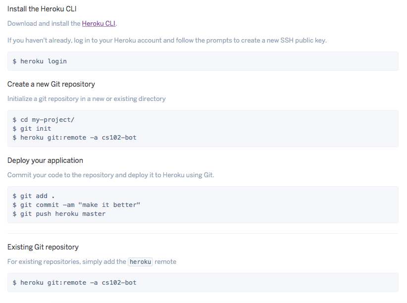

Эта работа посвящена созданию бота для социальной сети [Telegram](https://telegram.org). Для ее выполнения вам понадобится зарегистрироваться на сайте [https://telegram.org](https://telegram.org), если ранее вы этого не сделали.

!!! note "Мотивация"
    18 апреля 2016 года появилась [новость](https://telegram.org/blog/botprize), что выделенен призовой фонд в размере одного миллиона долларов для всех желающих поучаствовать в разработке собственного бота для сети Telegram. Гранты выдаваемые участникам начинались от 25 тысяч долларов.

    В сентябре 2019 года Telegram [анонсировал](https://contest.com/) новые конкурсы с суммарным призовым фондом более $1,000,000.


## Meet the Botfather

Предварительно мы рассмотрим простой пример создания так называемого эхо-бота, т.е. бота, который повторяет присланное ему сообщение. Чтобы зарегистрировать нового бота в телеграмме, вам нужно выполнить несколько шагов, которые подробно описаны в [руководстве разработчика ботов](https://core.telegram.org/bots). Ниже приведен пример регистрации бота с именем `cs102_bot`:


Обратите внимание, что последним ответом BotFather'а был токен доступа, который требуется для [авторизации](https://core.telegram.org/bots/api#authorizing-your-bot) бота и выполнения запросов к [API](https://core.telegram.org/bots/api).

!!! warning
    У вас будет свой токен доступа, которым не следует делиться с другими.

На текущем этапе созданный нами бот ничего не умеет делать и не знает ни одной команды. Для «обучения» бота мы будем использовать [Telegram Bot API](https://core.telegram.org/bots/api):

> The Bot API is an HTTP-based interface created for developers keen on building bots for Telegram.

Но, в отличии от работы с «API Вконтакте», мы не будем напрямую взамодействовать с API, а воспользуемся модулем [pyTelegramBotAPI](https://github.com/eternnoir/pyTelegramBotAPI). Подробное руководство на русском языке по работе с этим модулем вы можете найти [тут](https://kondra007.gitbooks.io/telegram-bot-lessons/content/chapter1.html).

Теперь нам нужно установить модуль pyTelegramBotAPI:

```sh
(cs102) $ python -m pip install pytelegrambotapi
```

Далее приведен пример эхо-бота, который дублирует каждое сообщение:

```python
import telebot


access_token = # PUT YOUR ACCESS TOKEN HERE
telegram.apihelper.proxy = {'https': 'https://23.237.22.172:3128'}

# Создание бота с указанным токеном доступа
bot = telebot.TeleBot(access_token)


# Бот будет отвечать только на текстовые сообщения
@bot.message_handler(content_types=['text'])
def echo(message: str) -> None:
    bot.send_message(message.chat.id, message.text)


if __name__ == '__main__':
    bot.polling()
```

!!! note
    Обратите внимание, что нам необходимо использовать proxy-соединение по причине [блокирования Telegram в России](https://ru.wikipedia.org/wiki/%D0%91%D0%BB%D0%BE%D0%BA%D0%B8%D1%80%D0%BE%D0%B2%D0%B0%D0%BD%D0%B8%D0%B5_Telegram_%D0%B2_%D0%A0%D0%BE%D1%81%D1%81%D0%B8%D0%B8). Если указанный proxy не работает, то попробуйте выбрать другой, например, на сайте [hidemy.name](https://hidemy.name/ru/proxy-list/) поддерживается большая онлайн-база прокси-листов.

Запустить бота можно следующим образом:

```sh
(cs102) $ python echo_bot.py
```

Теперь зайдите в телеграмм и напишите вашему боту любое сообщение:


## Обучаем бота командам

Целью работы является написать бота, который бы позволил получить расписание занятий для любой группы «Университета ИТМО», для этого обучим нашего бота понимать следующие команды:

* `near_lesson GROUP_NUMBER` - ближайшее занятие для указанной группы;
* `DAY WEEK_NUMBER GROUP_NUMBER` - расписание занятий в указанный день (`monday, thuesday, ...`). Неделя может быть четной (`1`), нечетной (`2`) или же четная и нечетная (`0`);
* `tommorow GROUP_NUMBER` - расписание на следующий день (если это воскресенье, то выводится расписание на понедельник, учитывая, что неделя может быть четной или нечетной);
* `all WEEK_NUMBER GROUP_NUMBER` - расписание на всю неделю.

Разберем пример с выводом расписания на понедельник. Для этого нам нужно получить код html-страницы для соответствующей группы, а затем из этой страницы выделить интересующую нас информацию.

Чтобы вам было проще ориентироваться в работе - рекомендуется скачать пример любой страницы с расписанием:

```html
</table><h4 class="rasp_day_mobile">Понедельник</h4>
  <div class="rasp_tabl_day">
      <table id="1day" class="rasp_tabl" border="0" cellpadding="0" cellspacing="0">
          <tbody>
              <tr>
                  <th class="day">
                      <script>$("#1day_btn").show();</script>
                      <span>Пн</span>
                  </th>
                  <td class="time">
                      <span>08:20-09:50</span>
                      <dt style="font-size:14px;"></dt>
                      <dd class="rasp_aud_mobile"></dd>
                      <dt class="rasp_corp_mobile">
                          <i class="fa fa-map-marker"></i>
                          <span>ул.Ломоносова, д.9, лит. Е</span>
                      </dt>
                  </td>
```

Чтобы получить исходный код страницы достаточно выполнить GET-запрос к адресу, который имеет следующий формат:

```
http://www.ifmo.ru/ru/schedule/0/GROUP/WEEK/raspisanie_zanyatiy_GROUP.htm
```

Где `WEEK` это неделя (четная-нечетная), если неделя не указана, то расписание включает и четную и нечетную недели; `GROUP` - номер группы.

!!! note
    Сайт Университета ИТМО не приветствует большого числа обращений. Поэтому подумайте о возможности сохранения страниц с расписанием локально или кешировании их в памяти на время работы бота, чтобы при повторном обращении к одной и той же странице боту не приходилось делать новый запрос к серверу университета.

```python
import requests
import config


def get_page(group: str, week: str='') -> str:
    if week:
        week = str(week) + '/'
    url = f'{config.domain}/{group}/{week}raspisanie_zanyatiy_{group}.htm'
    response = requests.get(url)
    web_page = response.text
    return web_page
```

```python
>>> page = get_page('K3142')
>>> page[595:631]
'Расписание занятий Университета ИТМО'
>>> ''.join(page[70439:71040].split())
'<h4class="rasp_day_mobile">Понедельник</h4><divclass="rasp_tabl_day"><tableid="1day"class="rasp_tabl"border="0"cellpadding="0"cellspacing="0"><tbody><tr><thclass="day"><script>$("#1day_btn").show();</script><span>Пн</span></th><tdclass="time"><span>08:20-09:50</span><dtstyle="font-size:14px;"></dt><ddclass="rasp_aud_mobile"></dd><dtclass="rasp_corp_mobile"><iclass="fafa-map-marker"></i><span>ул.Ломоносова,д.9,лит.Е</span></dt></td>'
```

Теперь из этой страницы нам нужно извлечь время занятий, место проведения, аудиторию и название дисциплины. Для этого нам понадобится HTML-парсер. В этой работе предлогается использовать модуль [BeautifulSoup](https://www.crummy.com/software/BeautifulSoup/bs4/doc/).

```python
from bs4 import BeautifulSoup
from typing import List, Tuple


def get_schedule(web_page: str) -> Tuple[List[str], List[str], List[str]]:
    soup = BeautifulSoup(web_page, "html5lib")
    
    # Получаем таблицу с расписанием на понедельник
    schedule_table = soup.find("table", attrs={"id": "1day"})

    # Время проведения занятий
    times_list = schedule_table.find_all("td", attrs={"class": "time"})
    times_list = [time.span.text for time in times_list]

    # Место проведения занятий
    locations_list = schedule_table.find_all("td", attrs={"class": "room"})
    locations_list = [room.span.text for room in locations_list]

    # Название дисциплин и имена преподавателей
    lessons_list = schedule_table.find_all("td", attrs={"class": "lesson"})
    lessons_list = [lesson.text.split('\n\n') for lesson in lessons_list]
    lessons_list = [', '.join([info for info in lesson_info if info]) for lesson_info in lessons_list]

    return times_list, locations_list, lessons_list
```

Методы `find` и `find_all` позволяют найти теги с указанными атрибутами.

Таким образом, мы получили время, место и название дисциплины (получение номера аудитории остается для самостоятельного выполнения). Наконец добавим нашему боту возможность вывода расписания на понедельник:

```python
@bot.message_handler(commands=['monday'])
def get_monday(message: str) -> None:
    _, group = message.text.split()
    web_page = get_page(group)
    times_lst, locations_lst, lessons_lst = get_schedule(web_page)

    resp = ''
    for time, location, lession in zip(times_lst, locations_lst, lessons_lst):
        resp += '<b>{}</b>, {}, {}\n'.format(time, location, lession)

    bot.send_message(message.chat.id, resp, parse_mode='HTML')
```


!!! note
    Вы можете легко обобщить функции `get_monday` и `get_schedule` на любой день недели.

## Размещаем бота в Сети  
Последняя часть работы посвящена размещению бота на облачной платформе [Heroku](https://www.heroku.com).

От вас требуется зарегистрироваться на Heroku и создать там новое приложение:


В папке с вашим проектом создайте три файла:

* `runtime.txt` - версия интерпретатора Python, которая требуется для запуска приложения;
* `requirements.txt` - модули, необходимые для работы приложения;
* `Procfile` - указывает тип приложения и главный класс (в нашем случае это python-приложение и файл bot.py соответственно).

Пример содержимого этих файлов приведен ниже:

```
### runtime.txt ###
python-3.8.0


### requirements.txt ###
beautifulsoup4==4.8.1
bs4==0.0.1
pyTelegramBotAPI==3.6.
requests==2.22.0


### Procfile ###
web: python3 bot.py
```

Далее зайдите на вкладку `Deploy`, где подробно описан процесс размещения вашего приложения на сервисе Heroku:



После пуша на heroku master приложение автоматически настраивает проект и запускает бота. При успешном завершении ваш бот должен работать на удалённой машине.
Чтобы проследить ход выполнения этих операций и найти возможные ошибки введите в консоли 
`heroku logs --tail`.
