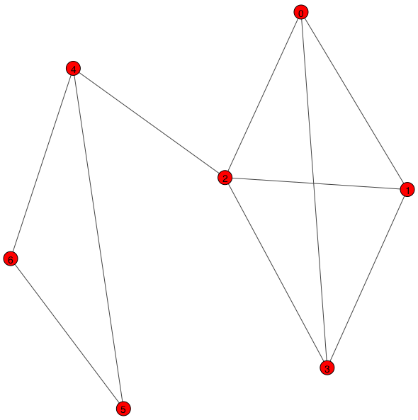

Эта работа посвящена основам анализа социальных сетей на примере взаимодействия с [API ВКонтакте](https://vk.com/dev/manuals).

!!! note
    Если вы не знакомы с термином «API», то рекомендую прочитать статью [«What is an API? In English, please»](https://medium.freecodecamp.org/what-is-an-api-in-english-please-b880a3214a82).

## Регистрация приложения и получение токена доступа

Чтобы начать работать с API от вас требуется зарегистрировать новое приложение. Для этого зайдите на форму создания нового Standalone приложения [https://vk.com/editapp?act=create](https://vk.com/editapp?act=create) и следуйте инструкциям. Вашему приложению будет назначен идентификатор, который потребуется для выполнения работы.

Запросы к API ВКонтакте имеют следующий формат ([из документации](https://vk.com/dev/api_requests)):

```
https://api.vk.com/method/METHOD_NAME?PARAMETERS&access_token=ACCESS_TOKEN&v=V
```

где:

* `METHOD_NAME` - это название метода API, к которому Вы хотите обратиться.
* `PARAMETERS` - входные параметры соответствующего метода API, последовательность пар `name=value`, объединенных амперсандом `&`.
* `ACCESSS_TOKEN` - ключ доступа.
* `V` - используемая версия API (в настоящий момент 5.103).


Например, чтобы получить список друзей, с указанием их пола, нужно выполнить следующий запрос:

```
https://api.vk.com/method/friends.get?fields=sex&access_token=0394a2ede332c9a13eb82e9b24631604c31df978b4e2f0fbd2c549944f9d79a5bc866455623bd560732ab&v=5.103
```

Так как токен доступа (`access_token`) ненастоящий, то этот запрос работать не будет. Чтобы получить токен доступа вы можете воспользоваться написанным для вас скриптом `access_token.py` следующим образом:

```sh
$ python access_token.py YOUR_CLIENT_ID -s friends
```

где вместо `YOUR_CLIENT_ID` необходимо подставить идентификатор вашего приложения.

После выполнения команды откроется новая вкладка браузера, из адресной строки которого вам необходимо скопировать токен доступа.


!!! note
    На этом этапе вы можете повторить ранее представленный пример запроса, чтобы убедиться, что вы делаете все верно.

Далее приведено содержимое файла `access_token.py`:

```python
import webbrowser
import argparse


def get_access_token(client_id, scope):
    assert isinstance(client_id, int), 'clinet_id must be positive integer'
    assert isinstance(scope, str), 'scope must be string'
    assert client_id > 0, 'clinet_id must be positive integer'
    url = """\
    https://oauth.vk.com/authorize?client_id={client_id}&\
    redirect_uri=https://oauth.vk.com/blank.hmtl&\
    scope={scope}&\
    &response_type=token&\
    display=page\
    """.replace(" ", "").format(client_id=client_id, scope=scope)
    webbrowser.open_new_tab(url)


if __name__ == "__main__":
    parser = argparse.ArgumentParser()
    parser.add_argument("client_id", help="Application Id", type=int)
    parser.add_argument("-s", dest="scope", help="Permissions bit mask", type=str, default="", required=False)
    args = parser.parse_args()
    get_access_token(args.client_id, args.scope)
```

## Прогнозирования возраста

Напишите функцию прогнозирования возраста пользователя по возрасту его друзей:

```python
def get_friends(user_id, fields):
    """ Returns a list of user IDs or detailed information about a user's friends """
    assert isinstance(user_id, int), "user_id must be positive integer"
    assert isinstance(fields, str), "fields must be string"
    assert user_id > 0, "user_id must be positive integer"
    # PUT YOUR CODE HERE
    pass
```

Для выполнения этого задания нужно получить список всех друзей для указанного пользователя, отфильтровать тех у кого возраст не указан или указаны только день и месяц рождения.

Для выполнения запросов к API мы будем использовать библиотеку [`requests`](http://docs.python-requests.org/en/master/):

```sh
(cs102) $ python -m pip install requests
```

Список пользователей можно получить с помощью метода [`friends.get`](https://vk.com/dev/friends.get). Ниже приведен пример обращения к этому методу для получения списка всех друзей указанного пользователя:

```python
domain = "https://api.vk.com/method"
access_token = # PUT YOUR ACCESS TOKEN HERE
user_id = # PUT USER ID HERE
fields = 'sex'
v = '5.103'

query = f"{domain}/friends.get?access_token={access_token}&user_id={user_id}&fields={fields}&v={v}"
response = requests.get(query)
```

Функция `requests.get` выполняет [GET запрос](https://ru.wikipedia.org/wiki/HTTP#GET) и возвращает объект `Response`, который представляет собой ответ сервера на посланный нами запрос.

Объект `Response` имеет множество атрибутов:
```python
>>> response.<tab>
response.apparent_encoding      response.history                response.raise_for_status
response.close                  response.is_permanent_redirect  response.raw
response.connection             response.is_redirect            response.reason
response.content                response.iter_content           response.request
response.cookies                response.iter_lines             response.status_code
response.elapsed                response.json                   response.text
response.encoding               response.links                  response.url
response.headers                response.ok
```

Нас будет интересовать только метод `response.json`, который возвращает [JSON](https://ru.wikipedia.org/wiki/JSON) объект:

```python
>>> response.json()
{'response': {'count': 136,
              'items': [{'first_name': 'Drake',
                         'id': 1234567,
                         'last_name': 'Wayne',
                         'online': 0,
                         'sex': 1},
                        {'first_name': 'Gracie'
                         'id': 7654321,
                         'last_name': 'Habbard',
                         'online': 0,
                         'sex': 0},
                         ...
>>> response.json()['response']['count']
136
>>> response.json()['response']['items'][0]['first_name']
'Drake'
```

Поле `count` содержит число записей, а `items` список словарей с информацией по каждому пользователю.

Выполняя запросы мы не можем быть уверены, что не возникнет ошибок. Возможны различные ситуации, например:

- есть неполадки в сети;
- удаленный сервер по какой-то причине не может обработать запрос;
- мы слишком долго ждем ответ от сервера.

В таких случаях необходимо попробовать повторить запрос. При этом повторные запросы желательно посылать не через константные промежутки времени, а по алгоритму экспоненциальной задержки.

!!! note
    Описание алгоритма с примерами можно найти в статье [Exponential Backoff](https://habrahabr.ru/post/227225/) или как «не завалить сервер». Почитать про обработку исключений при работе с библиотекой `requests` можно [тут](https://khashtamov.com/ru/python-requests/).

Напишите функцию `get()`, которая будет выполнять GET-запрос к указанному адресу, а при необходимости повторять запрос указанное число раз по алгоритму экспоненциальной задержки:

```python
def get(url, params={}, timeout=5, max_retries=5, backoff_factor=0.3):
    """ Выполнить GET-запрос
    
    :param url: адрес, на который необходимо выполнить запрос
    :param params: параметры запроса
    :param timeout: максимальное время ожидания ответа от сервера
    :param max_retries: максимальное число повторных запросов
    :param backoff_factor: коэффициент экспоненциального нарастания задержки
    """
    # PUT YOUR CODE HERE
    pass
```

```python
>>> get("https://httpbin.org/get")
>>> <Response [200]>

>>> get("https://httpbin.org/delay/2", timeout=1)
ReadTimeout: HTTPSConnectionPool(host='httpbin.org', port=443): Read timed out. (read timeout=1)

>>> get("https://httpbin.org/status/500")
HTTPError: 500 Server Error: INTERNAL SERVER ERROR for url: https://httpbin.org/status/500

>>> get("https://noname.com", timeout=1)
ConnectionError: HTTPSConnectionPool(host='noname.com', port=443): Max retries exceeded with url: /
```

На текущий момент вы должны заполнить тело функции `get_friends` так, чтобы она возвращала список друзей для указанного пользователя. Аргумент `fields` представляет из себя строку, в которой через запятую указываются какие поля необходимо получить по каждому пользователю.

Теперь мы можем написать функцию `age_predict` для «наивного» прогнозирования возраста пользователя с идентификатором `user_id` (под «наивным» прогнозированием подразумевается вычисление среднего арифметического или медианы):

```python
def age_predict(user_id):
    """
    >>> age_predict(???)
    ???
    """
    assert isinstance(user_id, int), "user_id must be positive integer"
    assert user_id > 0, "user_id must be positive integer"
    # PUT YOUR CODE HERE
    pass
```

!!! hint
    Так как дата рождения пользователя может быть не указана или указаны только день и месяц, то для обработки таких ситуаций вы можете использовать конструкцию `try...except`, где `except` будет содержать только `pass`.

## Поиск сообществ

Напишите функцию `get_network()`, которая для указанного списка пользователей `users_ids` строит граф и представляет его либо в виде матрицы смежности (`as_edgelist=False`), либо в виде списка ребер (`as_edgelist=True`). В полученном графе необходимо выделить сообщества и визуализировать результат.

```python
def get_network(users_ids, as_edgelist=True):
    """ Building a friend graph for an arbitrary list of users """
    # PUT YOUR CODE HERE
    pass
```

Поиск сообществ на графе (community detection) является хорошо изученной задачей, а ряд наиболее известных алгоритмов реализован в библиотеке `igraph`.

```bash
(cs102) $ python -m pip install python-igraph
(cs102) $ python -m pip install numpy
(cs102) $ python -m pip install cairocffi
(cs102) $ brew install cairo    # Только для MacOS X. Для других ОС см. https://www.cairographics.org/download/
```

Рассмотрим пример создания и визуализации графа состоящего из 6 узлов и 10 ребер:

```python
from igraph import Graph, plot
import numpy as np

# Создание вершин и ребер
vertices = [i for i in range(7)]
edges = [
    (0,2),(0,1),(0,3),
    (1,0),(1,2),(1,3),
    (2,0),(2,1),(2,3),(2,4),
    (3,0),(3,1),(3,2),
    (4,5),(4,6),
    (5,4),(5,6),
    (6,4),(6,5)
]

# Создание графа
g = Graph(vertex_attrs={"label":vertices},
    edges=edges, directed=False)

# Задаем стиль отображения графа
N = len(vertices)
visual_style = {}
visual_style["layout"] = g.layout_fruchterman_reingold(
    maxiter=1000,
    area=N**3,
    repulserad=N**3)

# Отрисовываем граф
plot(g, **visual_style)
```


Теперь удалим из графа петли и повторяющиеся ребра:

```python
g.simplify(multiple=True, loops=True)
```



```python
communities = g.community_edge_betweenness(directed=False)
clusters = communities.as_clustering()
print(clusters)
```

```
Clustering with 7 elements and 2 clusters
[0] 0, 1, 2, 3
[1] 4, 5, 6
```

```python
pal = igraph.drawing.colors.ClusterColoringPalette(len(clusters))
g.vs['color'] = pal.get_many(clusters.membership)
```


## Тематическое моделирование

Тематическое моделирование (topic modeling) одно из современных приложений машинного обучения к анализу текстов, активно развивающееся с конца 90-х годов. Тематическая модель (topic model) коллекции текстовых документов определяет, к каким темам относится каждый документ и какие слова (термины) образуют каждую тему http://www.machinelearning.ru/wiki/images/2/22/Voron-2013-ptm.pdf.

Данные для построения тематической модели мы будем собирать со стен различных групп, используя метод [wall.get](https://vk.com/dev/wall.get). Важной особенностью этого метода является то, что он не позволяет получить более 100 записей за один запрос, а так как к методам API ВКонтакте с ключом доступа пользователя или сервисным ключом доступа можно обращаться не чаще 3 раз в секунду, то, таким образом, мы имеем ограничение в 300 постов за секунду. Поэтому для более эффективного сбора сообщений со стен групп мы будем использовать метод [execute](https://vk.com/dev/execute) - «универсальный метод, который позволяет запускать последовательность других методов, сохраняя и фильтруя промежуточные результаты». Параметром в метод execute является код алгоритма в VKScript, который позволяет выполнить до 25 обращений к методам API. Таким образом, мы получим возможность выполнять до 75 обращений в секунду, то есть, 2500 постов.

Ниже приведен пример всех необходимых конструкций:

```js
var число = 1.234;
var массив_элементов = [];

if (условие) {
    список выражений;
}

while (условие) {
    тело цикла;
}

var doc = API.метод({параметры});
var значения = doc.ключ;
```

Пример запроса с использованием `execute`:

```python
code = """return API.wall.get({
    "owner_id": "",
    "domain": "itmoru",
    "offset": 0,
    "count": 1,
    "filter": "owner",
    "extended": 0,
    "fields": "",
    "v": "5.103"
});"""

response = requests.post(
    url="https://api.vk.com/method/execute",
        data={
            "code": code,
            "access_token": # PUT YOUR ACCESS TOKEN HERE
            "v": "5.103"
        }
)
```

Пример ответа:

```
>>> response.json()
{'response': {'count': 7601, 'items': [{'id': 42847, 'from_id': -94, 'owner_id': -94, 'date': 1572798277, 'marked_as_ads': 0, 'post_type': 'post', 'text': "ЗОЛОТО! 🏆\n\nКлим Гаврилов, студент 2 курса ИТМО, выиграл первые автоспортивные Олимпийские игры в классе Туринг! Поздравляем, это было очень круто 💪🏻\n\nПобеда Клима....
```

Напишите функцию `get_wall`, которая собирает записи со стены указанного сообщества:

```python
import pandas as pd
import requests
import textwrap

from pandas.io.json import json_normalize
from string import Template
from tqdm import tqdm


def get_wall(
    owner_id: str='',
    domain: str='',
    offset: int=0,
    count: int=10,
    filter: str='owner',
    extended: int=0,
    fields: str='',
    v: str='5.103'
) -> pd.DataFrame:
    """
    Возвращает список записей со стены пользователя или сообщества.

    @see: https://vk.com/dev/wall.get 

    :param owner_id: Идентификатор пользователя или сообщества, со стены которого необходимо получить записи.
    :param domain: Короткий адрес пользователя или сообщества.
    :param offset: Смещение, необходимое для выборки определенного подмножества записей.
    :param count: Количество записей, которое необходимо получить (0 - все записи).
    :param filter: Определяет, какие типы записей на стене необходимо получить.
    :param extended: 1 — в ответе будут возвращены дополнительные поля profiles и groups, содержащие информацию о пользователях и сообществах.
    :param fields: Список дополнительных полей для профилей и сообществ, которые необходимо вернуть.
    :param v: Версия API.
    """
    # PUT YOUR CODE HERE
    pass
```

Текст необходимо подготовить к построению тематической модели, а именно, удалить знаки пунктуации, ссылки, эмодзи, стоп-слова, провести нормализацию.

Для нормализации слов мы будем использовать морфологический анализатор [pymorphy2](https://pymorphy2.readthedocs.io/en/latest/):

```
(cs102) $ python -m pip install pymorphy2
```

В качестве тематической модели мы будем использовать модель [латентного размещения Дирихле](https://en.wikipedia.org/wiki/Latent_Dirichlet_allocation) (LDA, Latent Dirichlet Allocation), реализацию которой можно найти в библиотеке [gensim](https://radimrehurek.com/gensim/models/ldamodel.html).

```
(cs102) $ python -m pip install gensim
```