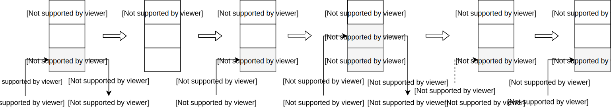

Во третьей лекции мы рассмотрим основные управляющие конструкции языка, такие как условия, циклы и исключения. Также в этой лекции будет наше первое знакомство с виртуальной машиной Python.

## Условия

Для проверки условий и выполнения соотвествующих инструкций используется конструкция `if-elif-else` со следующим синтаксисом:

```python
if something1:
    do1()
elif something2:
    do2()
elif something3:
    do3()
# ...
elif somethingN:
    doN()
else:
    do_something_else()
```

!!! attention
    В Python, в отличие от других языков программирования, тело некоторого блока (условия, цикла, функции, класса) обозначается отступами.

Давайте рассмотрим пример тела (содержимого) простой функции, используемой в качестве функции активации в нейронных сетях - [ReLU](https://en.wikipedia.org/wiki/Rectifier_(neural_networks)) (Rectified Linear Units), которая возвращает положительное или нулевое значение аргумента:

```python
x = 0.4    # 1
if x <= 0: # 2
    x = 0  # 3
else:
    x = x  # 5
print(x)   # 6
```

Условная конструкция получилась достаточно простой и очевидной, поэтому мы вкратце разберем то, как Python будет «интерпретировать» эти 6 строк кода.

Интерпретация, в простом понимании, означает чтение файла с исходным кодом вашей программы и поэтапное ее выполнение. В Python этапу интерпретации предшествует этап компиляции, то есть, исходный код ваших программ компилируется в [байт-код](https://ru.wikipedia.org/wiki/%D0%91%D0%B0%D0%B9%D1%82-%D0%BA%D0%BE%D0%B4) или другими словами в набор простых инструкций, чем-то напоминающих инструкции CPU, которые и будут выполняться (интерпретироваться) виртуальной машиной Python (в одной из следующих лекций мы будем говорить о том откуда берутся эти инструкции). Давайте посмотрим как выглядит байт-код для приведенного выше примера с помощью модуля [dis](https://docs.python.org/3/library/dis.html) из стандартной библиотеки:


```python
>>> import dis
>>> dis.dis("""...""")
  1           0 LOAD_CONST               0 (0.4)
              2 STORE_NAME               0 (x)

  2           4 LOAD_NAME                0 (x)
              6 LOAD_CONST               1 (0)
              8 COMPARE_OP               1 (<=)
             10 POP_JUMP_IF_FALSE       18

  3          12 LOAD_CONST               1 (0)
             14 STORE_NAME               0 (x)
             16 JUMP_FORWARD             4 (to 22)

  5     >>   18 LOAD_NAME                0 (x)
             20 STORE_NAME               0 (x)

  6     >>   22 LOAD_NAME                1 (print)
             24 LOAD_NAME                0 (x)
             26 CALL_FUNCTION            1
             28 POP_TOP
             30 LOAD_CONST               2 (None)
             32 RETURN_VALUE
```

Дизассемблированный вывод состоит из нескольких столбцов, краткое описание которых показано на следующем рисунке:


Итак, 6 строк кода были скомпилированы в 17 инструкций (описание инструкций можно найти [тут](https://docs.python.org/3/library/dis.html#python-bytecode-instructions)). Первые две инструкции соответствуют связыванию имени `x` со значением `0.4`. Следующие четыре инструкции посвящены сравнению `x` с нулем. Если результат сравнения оказался ложью, то мы переходим (`POP_JUMP_IF_FALSE`) к выполнению инструкции со смещением 18, в противном случае, переменная `x` связывается со значением `0` и мы переходим (`JUMP_FORWARD`) к выполнению инструкции со смещением 22. Последние шесть инструкций предназначены для вывода содержимого `x`.

Виртуальная машина Python имеет стековую архитектуру, то есть все данные необходимые для выполнения инструкций помещаются (push) на стек или снимаются (pop) с него, такой стек называется стеком данных (data stack или evaluation stack). Для наглядности ниже проиллюстрировано состояние стека при выполнении нескольких первых инструкций:



Как же выполняются интсрукции? Выполнение инструкций происходит в [бесконечном цикле](https://github.com/python/cpython/blob/3.8/Python/ceval.c#L1323) с условием в несколько тысяч строк кода, в качестве примера ниже представлен соответствующий Си-код для инструкции [`COMPARE_OP`](https://github.com/python/cpython/blob/3.8/Python/ceval.c#L2974):

```c
case TARGET(COMPARE_OP): {
    PyObject *right = POP();
    PyObject *left = TOP();
    PyObject *res = cmp_outcome(tstate, oparg, left, right);
    Py_DECREF(left);
    Py_DECREF(right);
    SET_TOP(res);
    if (res == NULL)
        goto error;
    PREDICT(POP_JUMP_IF_FALSE);
    PREDICT(POP_JUMP_IF_TRUE);
    DISPATCH();
}
```

Инструкция достаточно простая, если кратко, то выполняются следующие шаги:

- с вершины стека снимаем значение и сохраняем его в переменной `right`;
- в переменную `left` сохраняем значение, которое находится на вершине стека;
- вызываем функцию сравнения для `left` и `right` и затем результат сохраняем в переменной `res`;
- уменьшаем счетчик ссылок на `left` и `right`;
- результат сравнения помещаем на вершину стека «затерев» старое значение;
- проверяем, что не возникло ошибок при сравнении;
- пытаемся «предсказать» следующую инструкцию и, если возможно, то переходим к ней;
- переходим к следующей инструкции на выполнение не по предсказанию.

Итак, это наше первое знакомство с виртуальной машиной Python и байт-кодом, на протяжении следующих лекций мы будем постепенно детализировать наше понимание работы виртуальной машины Python, тем не менее мы уже можем пожинать плоды первого знакомства, например, мы можем отвечать на вопросы почему одна форма записи некоторого выражения работает быстрее чем другая (попрбуйте сравнить два способа создания словаря [`dict()` и `{}`](https://medium.com/@jodylecompte/dict-vs-in-python-whats-the-big-deal-anyway-73e251df8398)).

## Продолжая говорить об условиях

В Python есть условные выражения, которые соответствуют тернарному оператору в других языках программирования [^1]:

```python
x = 0.4
x = 0 if x <= 0 else x
print(x)
```

```python
>>> dis.dis("x = 0.4; x = 0 if x <= 0 else x; print(x)")
  1           0 LOAD_CONST               0 (0.4)
              2 STORE_NAME               0 (x)
              4 LOAD_NAME                0 (x)
              6 LOAD_CONST               1 (0)
              8 COMPARE_OP               1 (<=)
             10 POP_JUMP_IF_FALSE       16
             12 LOAD_CONST               1 (0)
             14 JUMP_FORWARD             2 (to 18)
        >>   16 LOAD_NAME                0 (x)
        >>   18 STORE_NAME               0 (x)
             20 LOAD_NAME                1 (print)
             22 LOAD_NAME                0 (x)
             24 CALL_FUNCTION            1
             26 POP_TOP
             28 LOAD_CONST               2 (None)
             30 RETURN_VALUE
```

Как и в других языках программирования в условиях мы можем использовать несколько логических выражений объединив их с помощью операторов `and` и `or` (также можно использовать логическое отрицание с помощью оператора `not`, а с версии 3.8 стало возможным использовать оператор присваивания [^2]):

```python
email = "Dementiy@yandex.ru"
domains = ["yandex.ru", "mail.ru", "gmail.com"]
if "@" in email and email.split('@')[-1] in domains:
    print("Email указан верно")
else:
    print("Email указан не верно")
```

```python
>>> dis.dis("""...""")
..
  3          14 LOAD_CONST               4 ('@')
             16 LOAD_NAME                0 (email)
             18 COMPARE_OP               6 (in)
             20 POP_JUMP_IF_FALSE       50
             22 LOAD_NAME                0 (email)
             24 LOAD_ATTR                2 (split)
             26 LOAD_CONST               4 ('@')
             28 CALL_FUNCTION            1
             30 LOAD_CONST               9 (-1)
             32 BINARY_SUBSCR
             34 LOAD_NAME                1 (domains)
             36 COMPARE_OP               6 (in)
             38 POP_JUMP_IF_FALSE       50
...
  6     >>   50 LOAD_NAME                3 (print)
             52 LOAD_CONST               7 ('Email указан не верно')
             54 CALL_FUNCTION            1
             56 POP_TOP
...
```

Обратите внимание на то, как происходит «объединение» условных выражений в байт-коде с помощью оператора `and`: если символ «собаки» не присутствует в строке с адресом электронной почты, то мы переходим к инструкции по смещению 50 и оставшаяся часть логического выражение не проверяется. Попробуйте заменить логический оператор `and` на `or` и посмотреть как изменится байт-код.

Мы можем вкладывать условные конструкции одна в другую, указывая вложенность отступами:

```python
mark = 71

if mark >= 91:
    grade = 'A'
else:
    if mark >= 85:
        grade = 'B'
    else:
        if mark >= 75:
            grade = 'C'
        else:
            if mark >= 67:
                grade = 'D'
            else:
                if mark >= 60:
                    grade = 'E'
                else:
                    grade = 'F'

print(grade)
```

А можем использовать более короткую форму записи с помощью `elif`:

```python
mark = 71

if mark >= 91:
    grade = 'A'
elif mark >= 85:
    grade = 'B'
elif mark >= 75:
    grade = 'C'
elif mark >= 67:
    grade = 'D'
elif mark >= 60:
    grade = 'E'
else:
    grade = 'F'

print(grade)
```

Если вы сравните байт-код для приведенных примеров, то он окажется полностью идентичным. Поэтому разница между двумя формами записи `if-else-if` и `if-elif` только стилистическая.

## Циклы

Условно циклы можно разделить на циклы со счетчиком и совместные циклы, но с точки зрения байт-кода они эквивалентны. Цикл со счётчиком это цикл, в котором некоторая переменная изменяет своё значение от заданного начального значения до конечного значения с некоторым шагом, и для каждого значения этой переменной тело цикла выполняется один раз.

Общая форма записи циклов со счётчиком следующая:

```python
for counter in range(start, stop, step):
    expression
```

Например:

```python
for i in range(1, 10, 2):
    print(i)
```

Ниже представлены различные варианты использования `range`:

Шаблон  | Пример | Результат
--------|--------|----------
range(end) | range(5) | [0, 1, 2, 3, 4]
range(start, end) | range(1, 5) | [1, 2, 3, 4]
range(start, end, step) | range(1, 10, 2) | [1, 3, 5, 7, 9]

Давайте посмотрим на список инструкций, которые будут выполнены для цикла приведенного выше:

```python
>>> dis.dis("for i in range(1, 10, 2): print(i)")
  1           0 LOAD_NAME                0 (range)
              2 LOAD_CONST               0 (1)
              4 LOAD_CONST               1 (10)
              6 LOAD_CONST               2 (2)
              8 CALL_FUNCTION            3
             10 GET_ITER
        >>   12 FOR_ITER                12 (to 26)
             14 STORE_NAME               1 (i)
             16 LOAD_NAME                2 (print)
             18 LOAD_NAME                1 (i)
             20 CALL_FUNCTION            1
             22 POP_TOP
             24 JUMP_ABSOLUTE           12
        >>   26 LOAD_CONST               3 (None)
             28 RETURN_VALUE
```

Инструкция `GET_ITER` [возвращает](https://github.com/python/cpython/blob/3.8/Python/ceval.c#L3156) итератор для объекта, который находится на вершине стека (в нашем примере это `range(1,10,2)`). `FOR_ITER` [возвращает](https://github.com/python/cpython/blob/3.8/Python/ceval.c#L3198) следующее значение из итератора (в нашем примере это 1,3,5,7,9) и помещает его на вершину стека. Инструкция `STORE_NAME` снимает значение с вершины стека и связывает его с именем `i`. Затем выполняется тело цикла (печать переменной `i`) и все повторяется снова до тех пор пока итератор не будет исчерпан:


Рассмотрим еще один пример использования цикла со счетчиком: посчитаем средний балл по некоторой дисциплине для группы студентов из 10 человек:

```python
import random
random.seed(1234)
scores = [random.randint(0, 100) for _ in range(10)]
print(f'Scores: {scores}')
# Scores: [12, 98, 45, 30, 2, 3, 100, 2, 44, 82]

mean_score = 0
for i in range(len(scores)):
    mean_score += scores[i]
mean_score = mean_score / len(scores)
print(f'Mean score: {mean_score}')
# Mean score: 41.8
```

Как уже было сказано еще один вид циклов это совместные циклы. Такие циклы задают выполнение некоторой операции для объектов из заданного множества, без явного указания порядка перечисления этих объектов.

Общая форма записи совместных циклов следующая:

```python
for item in iterable:
    expression
```

Где `iterable` это итерируемый объект. В роли такого объекта могут выступать строки, списки, кортежи, словари, а также любой класс, объявленный с магическими методомами `__iter__` или `__getitem__` (`range`, как вы могли догадаться, также является итерируемым объектом). Об итерируемых объектах и итераторах более подробно мы будем говорить в одной из следующих лекций.

Если переписать предыдущий пример с использованием совместного цикла, то получим:

```python
mean_score = 0
for score in scores:
    mean_score += score
mean_score = mean_score / len(scores)
print(f'Mean score: {mean_score}')
# Mean score: 41.8
```

!!! hint
    Если при итерировании нам одновременно необходимо получать «индексы» элементов, то можно воспользоваться «функцией» `enumerate()`.

Последний вид циклов это цикл с предусловием — цикл, который выполняется пока истинно некоторое условие, указанное перед его началом. Это условие проверяется до выполнения тела цикла, поэтому тело может быть не выполнено ни разу (если условие с самого начала ложно).

Общая форма записи циклов с предусловием следующая:

```python
while condition:
    loop_body
```

Рассмотрим пример вычисления факториала числа `n`:

```python
fact = 1
n = 5
while n:
    fact = fact * n
    n -= 1
print(fact) # 1 * 2 * 3 * 4 * 5 = 120
```

```python
>>> dis.dis("""...""")
  1           0 LOAD_CONST               0 (1)
              2 STORE_NAME               0 (fact)

  2           4 LOAD_CONST               1 (5)
              6 STORE_NAME               1 (n)

  3     >>    8 LOAD_NAME                1 (n)
             10 POP_JUMP_IF_FALSE       30

  4          12 LOAD_NAME                0 (fact)
             14 LOAD_NAME                1 (n)
             16 BINARY_MULTIPLY
             18 STORE_NAME               0 (fact)

  5          20 LOAD_NAME                1 (n)
             22 LOAD_CONST               0 (1)
             24 INPLACE_SUBTRACT
             26 STORE_NAME               1 (n)
             28 JUMP_ABSOLUTE            8

  6     >>   30 LOAD_NAME                2 (print)
             32 LOAD_NAME                0 (fact)
             34 CALL_FUNCTION            1
             36 POP_TOP
             38 LOAD_CONST               2 (None)
             40 RETURN_VALUE
```

С точки зрения байт-кода цикл `while` не сложнее условных конструкций, если условие ложно, то мы переходим (`POP_JUMP_IF_FALSE`) к первой инструкции после тела цикла, в противном случае выполняется тело цикла и осуществляется безусловный переход (`JUMP_ABSOLUTE`) к повторной проверке условия.

### Досрочный выход из цикла

Команда досрочного выхода `break` применяется, когда необходимо прервать выполнение цикла, в котором условие выхода ещё не достигнуто:

```python
n = 9
guess = n
epsilon = 1E-9
while True:
    last = guess
    guess = (guess + n / guess) * 0.5
    if abs(guess - last) < epsilon:
        break
print(guess)
# 3.0
```

Давайте посмотрим на байт-код:

```python
...
  5     >>   12 LOAD_NAME                1 (guess)
             14 STORE_NAME               3 (last)
...
  7          32 LOAD_NAME                4 (abs)
             34 LOAD_NAME                1 (guess)
             36 LOAD_NAME                3 (last)
             38 BINARY_SUBTRACT
             40 CALL_FUNCTION            1
             42 LOAD_NAME                2 (epsilon)
             44 COMPARE_OP               0 (<)
             46 POP_JUMP_IF_FALSE       12

  8          48 JUMP_ABSOLUTE           52
             50 JUMP_ABSOLUTE           12

  9     >>   52 LOAD_NAME                5 (print)
...
```

Обратите внимание, что инструкция со смещением 50 никогда не будет выполнена, так как цикл является бесконечным. Выход из цикла осуществляется с помощью оператора `break` и соотвествующей инструкции `JUMP_ABSOLUTE`, которая выполняется при условии, что мы достигли необходимой точности при вычислении квадратного корня.

### Пропуск итерации

Оператор `continue` применяется, когда в текущей итерации цикла необходимо пропустить все команды до конца тела цикла, но при этом сам цикл прерываться не должен, условия продолжения или выхода должны вычисляться обычным образом. Рассмотрим простой пример, допустим мы хотим посчитать средний балл, но в данных могут присутствовать пропуски, которые мы не должны учитывать:

```python
scores = [random.randint(0, 100) for _ in range(10)]
scores.extend([None] * 3)
random.shuffle(scores)
print(f'Scores: {scores}')
# Scores: [78, None, 1, 11, 23, 19, 79, None, None, 61, 59, 91, 14]

mean_score = 0
n = 0
for score in scores:
    if score is None:
        continue
    mean_score += score
    n += 1
mean_score = mean_score / n
print(f'Mean score is {mean_score} for {n} scores')
# Mean score is 43.6 for 10 scores
```

С точки зрения байт-кода оператор `continue` представлен простой инструкцией безусловного перехода `JUMP_ABSOLUTE`.

!!! note
    У всех видов циклов есть необязательная ветвь [`else`](https://docs.python.org/3/tutorial/controlflow.html#break-and-continue-statements-and-else-clauses-on-loops).

## Исключения

Если вы попробуете вычислить выражение `1 / 0` в интерпретаторе Python, то будет порождено исключение `ZeroDivisionError` (ошибка деления на ноль). Существует (как минимум) три различимых вида ошибок:

 - синтаксические ошибки (syntax errors);
 - [логические ошибки](https://ru.wikipedia.org/wiki/%D0%9B%D0%BE%D0%B3%D0%B8%D1%87%D0%B5%D1%81%D0%BA%D0%B0%D1%8F_%D0%BE%D1%88%D0%B8%D0%B1%D0%BA%D0%B0_(%D0%BF%D1%80%D0%BE%D0%B3%D1%80%D0%B0%D0%BC%D0%BC%D0%B8%D1%80%D0%BE%D0%B2%D0%B0%D0%BD%D0%B8%D0%B5)) (logic errors) - в программировании логической ошибкой называется баг, который приводит к некорректной работе программы, но не к краху программы;
 - и исключения (exceptions).

Исключения бывают разных типов и тип исключения выводится в сообщении об ошибке, например `ZeroDivisionError`, `IndexError`, `KeyError`, `ValueError` и т.д. Для работы с исключениями используется конструкция `try...except` [^3]:

```python
try:
    1 / 0
except:
    pass
```

Давайте рассмотрим список инструкций, которые будут выполнены виртуальной машиной Python:

```python
  1           0 SETUP_FINALLY           12 (to 14)

  2           2 LOAD_CONST               0 (1)
              4 LOAD_CONST               1 (0)
              6 BINARY_TRUE_DIVIDE
              8 POP_TOP
             10 POP_BLOCK
             12 JUMP_FORWARD            12 (to 26)

  3     >>   14 POP_TOP
             16 POP_TOP
             18 POP_TOP

  4          20 POP_EXCEPT
             22 JUMP_FORWARD             2 (to 26)
             24 END_FINALLY
        >>   26 LOAD_CONST               2 (None)
             28 RETURN_VALUE
```

Вам уже должны быть знакомы инструкции соответствующие второй строке: на стек данных помещаются два значения, выполняется операция деления, результат снимается с вершины стека и наконец осуществляется переход к инструкции по смещению 26. Но остаются вопросы: «Каким будет порядок выполнения, если было выброшено исключение?», «Как о нем узнает интерпретатор?», «Как оно будет обработано?» и т.д. Давайте начнем с рассмотрения инструкции `SETUP_FINALLY`:

```c
case TARGET(SETUP_FINALLY): {
    /* NOTE: If you add any new block-setup opcodes that
        are not try/except/finally handlers, you may need
        to update the PyGen_NeedsFinalizing() function.
        */

    PyFrame_BlockSetup(f, SETUP_FINALLY, INSTR_OFFSET() + oparg,
                        STACK_LEVEL());
    DISPATCH();
}
```

Кроме стека данных, о котором мы говорили ранее, есть еще стек блоков (block stack) ограниченного размера[^4], который используется для «открутки» стека данных на момент входа в `try` или контекстный менеджер `with` [^5]. В обработчике инструкции `SETUP_FINALLY` происходит вызов функции [`PyFrame_BlockSetup`](https://github.com/python/cpython/blob/3.8/Objects/frameobject.c#L741), которая помещает на стек блоков новый «элемент», со следующими аргументами: указатель на текущий фрейм (о фреймах мы будем говорить в одной из следующих лекций), тип блока, адрес обработчика (адрес инструкции, на которую следует перейти, если было выброшено исключение) и текущая глубина стека данных (до какого момента мы будем «откручивать» стек данных в случае возникновения исключения):

```c
void
PyFrame_BlockSetup(PyFrameObject *f, int type, int handler, int level)
{
    PyTryBlock *b;
    if (f->f_iblock >= CO_MAXBLOCKS)
        Py_FatalError("XXX block stack overflow");
    b = &f->f_blockstack[f->f_iblock++];
    b->b_type = type;
    b->b_level = level;
    b->b_handler = handler;
}
```

```c
typedef struct {
    int b_type;                 /* what kind of block this is */
    int b_handler;              /* where to jump to find handler */
    int b_level;                /* value stack level to pop to */
} PyTryBlock;
```

Если инструкция `SETUP_FINALLY` помещает в стек блоков новый элемент, то инструкция `POP_BLOCK` выталкивает элемент из стека блоков:

```c
case TARGET(POP_BLOCK): {
    PREDICTED(POP_BLOCK);
    PyFrame_BlockPop(f);
    DISPATCH();
}
```

```c
PyTryBlock *
PyFrame_BlockPop(PyFrameObject *f)
{
    PyTryBlock *b;
    if (f->f_iblock <= 0)
        Py_FatalError("XXX block stack underflow");
    b = &f->f_blockstack[--f->f_iblock];
    return b;
}
```

Как же интерпретатор узнает о том, что было порождено исключение? Давайте рассмотрим инструкцию `BINARY_TRUE_DIVIDE`:

```c
case TARGET(BINARY_TRUE_DIVIDE): {
    PyObject *divisor = POP();
    PyObject *dividend = TOP();
    PyObject *quotient = PyNumber_TrueDivide(dividend, divisor);
    Py_DECREF(dividend);
    Py_DECREF(divisor);
    SET_TOP(quotient);
    if (quotient == NULL)
        goto error;
    DISPATCH();
}
```

Будет вызвана функция `PyNumber_TrueDivide` и, если проследить всю цепочку вызовов, то мы дойдоем до функции [`long_true_divide`](https://github.com/python/cpython/blob/3.8/Objects/longobject.c#L3881):

```c
static PyObject *
long_true_divide(PyObject *v, PyObject *w)
{
    // ...
    a_size = Py_ABS(Py_SIZE(a));
    b_size = Py_ABS(Py_SIZE(b));
    negate = (Py_SIZE(a) < 0) ^ (Py_SIZE(b) < 0);
    if (b_size == 0) {
        PyErr_SetString(PyExc_ZeroDivisionError,
                        "division by zero");
        goto error;
    }
    // ...
  error:
    return NULL;
}
```

которая возвращает `NULL` при возникновении различного рода ошибок, например, при делении на ноль. [`PyErr_SetString`](https://github.com/python/cpython/blob/3.8/Python/errors.c#L210) позволяет задать тип исключения и сообщение об ошибке. Информация об исключении сохраняется в структуре [`PyThreadState`](https://github.com/python/cpython/blob/3.8/Include/cpython/pystate.h#L51), отражающей состояние текущего потока:

```c
void
_PyErr_Restore(PyThreadState *tstate, PyObject *type, PyObject *value,
               PyObject *traceback)
{
    // ...
    tstate->curexc_type = type;
    tstate->curexc_value = value;
    tstate->curexc_traceback = traceback;
    // ...
}
```

Итак, произошла ошибка деления на ноль, а в структуре потока сохранены тип исключения, сообщение об ошибке и трассировочный объект (traceback). Давайте вернемся к инструкции `BINARY_TRUE_DIVIDE`, если результатом вызова функции `PyNumber_TrueDivide` является `NULL`, то осуществляется переход к метке [`error`](https://github.com/python/cpython/blob/3.8/Python/ceval.c#L3707), за которой следует метка `exception_unwind`, где и происходит откуртка стека данных:

```c hl_lines="7 13 50"
error:
    // ...
exception_unwind:
        /* Unwind stacks if an exception occurred */
        while (f->f_iblock > 0) {
            /* Pop the current block. */
            PyTryBlock *b = &f->f_blockstack[--f->f_iblock];

            if (b->b_type == EXCEPT_HANDLER) {
                UNWIND_EXCEPT_HANDLER(b);
                continue;
            }
            UNWIND_BLOCK(b);
            if (b->b_type == SETUP_FINALLY) {
                PyObject *exc, *val, *tb;
                int handler = b->b_handler;
                _PyErr_StackItem *exc_info = tstate->exc_info;
                /* Beware, this invalidates all b->b_* fields */
                PyFrame_BlockSetup(f, EXCEPT_HANDLER, -1, STACK_LEVEL());
                PUSH(exc_info->exc_traceback);
                PUSH(exc_info->exc_value);
                if (exc_info->exc_type != NULL) {
                    PUSH(exc_info->exc_type);
                }
                else {
                    Py_INCREF(Py_None);
                    PUSH(Py_None);
                }
                _PyErr_Fetch(tstate, &exc, &val, &tb);
                /* Make the raw exception data
                   available to the handler,
                   so a program can emulate the
                   Python main loop. */
                _PyErr_NormalizeException(tstate, &exc, &val, &tb);
                if (tb != NULL)
                    PyException_SetTraceback(val, tb);
                else
                    PyException_SetTraceback(val, Py_None);
                Py_INCREF(exc);
                exc_info->exc_type = exc;
                Py_INCREF(val);
                exc_info->exc_value = val;
                exc_info->exc_traceback = tb;
                if (tb == NULL)
                    tb = Py_None;
                Py_INCREF(tb);
                PUSH(tb);
                PUSH(val);
                PUSH(exc);
                JUMPTO(handler);
                /* Resume normal execution */
                goto main_loop;
            }
        } /* unwind stack */

        /* End the loop as we still have an error */
        break;
    } /* main loop */

    assert(retval == NULL);
    assert(_PyErr_Occurred(tstate));
```

При обработке исключения «снимается» один блок со стека блоков, раскручивается стек данных до момента входа в блок (см. макрос `UNWIND_BLOCK`) и наконец осуществляется переход непосредственно к обработчику исключения, в нашем примере это переход к инструкции со смещением 14, где со стека данных последовательно выталкивается три элемента и затем выполняется инструкция [`POP_EXCEPT`](https://github.com/python/cpython/blob/3.8/Python/ceval.c#L2099):


```c
case TARGET(POP_EXCEPT): {
    PyObject *type, *value, *traceback;
    _PyErr_StackItem *exc_info;
    PyTryBlock *b = PyFrame_BlockPop(f);
    if (b->b_type != EXCEPT_HANDLER) {
        _PyErr_SetString(tstate, PyExc_SystemError,
                            "popped block is not an except handler");
        goto error;
    }
    assert(STACK_LEVEL() >= (b)->b_level + 3 &&
            STACK_LEVEL() <= (b)->b_level + 4);
    exc_info = tstate->exc_info;
    type = exc_info->exc_type;
    value = exc_info->exc_value;
    traceback = exc_info->exc_traceback;
    exc_info->exc_type = POP();
    exc_info->exc_value = POP();
    exc_info->exc_traceback = POP();
    Py_XDECREF(type);
    Py_XDECREF(value);
    Py_XDECREF(traceback);
    DISPATCH();
}
```
[^1]:
    [PEP 308 -- Conditional Expressions](https://www.python.org/dev/peps/pep-0308/)
[^2]:
    [PEP 572 -- Assignment Expressions](https://www.python.org/dev/peps/pep-0572/)
[^3]:
    [PEP 3110 -- Catching Exceptions in Python 3000](https://www.python.org/dev/peps/pep-3110/)
[^4]:
    Максимальное число вложенных блоков определяется константой [`CO_MAXBLOCKS`](https://github.com/python/cpython/blob/3.8/Include/code.h#L114), значение которой равно 20. Другими словами, вы можете создать не более 20 вложенных циклов или обработчиков исключений, но на 21 уровне вложенности вы получите ошибку `SyntaxError: too many statically nested blocks`.
[^5]:
    До версии 3.8 стек блоков также использовался и для [циклов](https://docs.python.org/3.8/whatsnew/3.8.html#cpython-bytecode-changes).