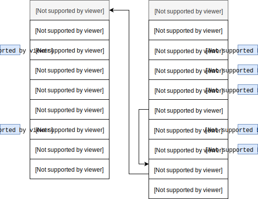

В этой мы продолжим знакомство с основными типами данных в Python и поговорим об изменяемых типах.


## Списки

```python
>>> scores = []
>>> scores
[]
```

```python
>>> scores = [90.4, 83, 85, 72.3, 65, 84.5, 76, 80, 64.9, 61]
>>> scores
[90.4, 83, 85, 72.3, 65, 84.5, 76, 80, 64.9, 61]
```

```python
>>> scores[0]
90.4
```

```python
>>> len(scores)
10
```

```python
>>> mean_score = sum(scores) / len(scores)
>>> mean_score
```

```python
>>> scores.append(90)
>>> scores
[90.4, 83, 85, 72.3, 65, 84.5, 76, 80, 64.9, 61, 90]
```

```python
>>> scores.extend([58, 91.5, 79])
>>> scores
[90.4, 83, 85, 72.3, 65, 84.5, 76, 80, 64.9, 61, 90, 58, 91.5, 79]
```

```python
>>> scores_copy = scores.copy() # == scores[:] == list(scores)
>>> scores_copy
[90.4, 83, 85, 72.3, 65, 84.5, 76, 80, 64.9, 61, 90, 58, 91.5, 79]
```

```python
>>> sorted(scores, reverse=True)
```

### Списки как динамические массивы

Списки в Python являются обычными [динамическими массивами](https://en.wikipedia.org/wiki/Dynamic_array) (вектор в C++) и обладают всеми их свойствами с точки зрения производительности: в частности, обращение к элементу по его индексу имеет сложность $O(1)$, а поиск элемента имеет сложность $O(N)$.

Списки в CPython определены с помощью следующей [структуры](https://github.com/python/cpython/blob/master/Include/listobject.h#L23):

```c
typedef struct {
    PyObject_VAR_HEAD
    /* Vector of pointers to list elements.  list[0] is ob_item[0], etc. */
    PyObject **ob_item;

    /* ob_item contains space for 'allocated' elements.  The number
     * currently in use is ob_size.
     * Invariants:
     *     0 <= ob_size <= allocated
     *     len(list) == ob_size
     *     ob_item == NULL implies ob_size == allocated == 0
     * list.sort() temporarily sets allocated to -1 to detect mutations.
     *
     * Items must normally not be NULL, except during construction when
     * the list is not yet visible outside the function that builds it.
     */
    Py_ssize_t allocated;
} PyListObject;
```

Где:

- `ob_item` - массив указателей на `PyObject`;
- `allocated` - емкость массива (размер буффера), то есть сколько элементов можно поместить в массив `ob_item` до его увеличения, в то время как `ob_size` - текущее количество элементов в массиве.

{: .center}

Если мы добавляем новый элемент в массив и при этом размер массива совпадает с размером буффера, то есть, `ob_size == allocated`, то происходит увеличение размера буффера путем перераспределения памяти по следующему правилу:

```c
/* This over-allocates proportional to the list size, making room
 * for additional growth.  The over-allocation is mild, but is
 * enough to give linear-time amortized behavior over a long
 * sequence of appends() in the presence of a poorly-performing
 * system realloc().
 * The growth pattern is:  0, 4, 8, 16, 25, 35, 46, 58, 72, 88, ...
 * Note: new_allocated won't overflow because the largest possible value
 *       is PY_SSIZE_T_MAX * (9 / 8) + 6 which always fits in a size_t.
 */
new_allocated = (size_t)newsize + (newsize >> 3) + (newsize < 9 ? 3 : 6);
```

Давайте посмотрим на процесс перераспределения памяти в действии с помощью модуля ctypes:

```python
class ListStruct(ctypes.Structure):
    _fields_ = [("ob_refcnt", ctypes.c_ssize_t),
                ("ob_type", ctypes.c_void_p),
                ("ob_size", ctypes.c_ssize_t),
                ("ob_item", ctypes.c_long),  # PyObject** pointer cast to long
                ("allocated", ctypes.c_ssize_t)]
    
    def __repr__(self):
        return f"ListStruct(ob_size={self.ob_size}, allocated={self.allocated})"
```

Создадим пустой список:

```python
>>> L = []
>>> ls = ListStruct.from_address(id(L))
>>> ls
ListStruct(ob_size=0, allocated=0)
```
{: .center}

Пустой список имеет размер ноль и емкость ноль. Добавим один элемент:

```python
>>> L.append(1)
>>> ls
ListStruct(ob_size=1, allocated=4)
```

{: .center}

Как мы видим и размер и емкость списка изменились в соответствии с правилом роста. Добавим еще несколько элементов в список:

```python
>>> L.extend([2,3,4])
>>> ls
ListStruct(ob_size=4, allocated=4)
>>> L.append(5)
>>> ls
ListStruct(ob_size=5, allocated=8)
```

{: .center}


Итак, давайте отметим основные различия между кортежами и списками:

* с точки зрения внутреннего представления кортежи являются статическими массивами, а списки динамическими;
* кортежи занимают меньше места в памяти, так как имеют фиксированную длину;
* кортежи неизменяемые (immutable) и могут быть выступать в качестве ключей словарей или элементов множеств;
* кортежи обычно представляют абстрактные объекты, обладающие некоторой структурой (см. [`namedtuple`](https://docs.python.org/3/library/collections.html#collections.namedtuple) модуля `collections` или [`NamedTuple`](https://docs.python.org/3/library/typing.html#typing.NamedTuple) из модуля `typing`).

## Словари

Словари являются одной из самых важных и сложных структур в Python и мы с ними будем постоянно встречаться. Словари представляют собой множество упорядоченных пар вида «ключ:значение».

Иногда словари называют [ассоциативными массивами](https://ru.wikipedia.org/wiki/%D0%90%D1%81%D1%81%D0%BE%D1%86%D0%B8%D0%B0%D1%82%D0%B8%D0%B2%D0%BD%D1%8B%D0%B9_%D0%BC%D0%B0%D1%81%D1%81%D0%B8%D0%B2), иногда отображениями (имеется ввиду отображение множества ключей словаря в множество его значений).

Как и списки, словари имеют переменную длину, произвольную вложенность и могут хранить значения произвольных типов.

Создадим словарь с данными о населении ряда стран (ключами в таком словаре будут страны, а значениями - размер населения):

```python
>>> population_by_countries = {
    'India': 1326801576,
    'Brazil': 209567920,
    'China': 1382323332,
    'Nigeria': 186987563,
    'Bangladesh': 162910864,
    'U.S.': 324118787,
    'Russia': 143439832,
    'Pakistan': 192826502,
    'Mexico': 128632004
}
```

Иногда у нас есть отдельно списки ключей и значений, из которых мы хотим создать словарь:

```python
>>> countries = ['India', 'Brazil', 'China', 'Nigeria', 'Bangladesh', 'U.S.', 'Russia', 'Pakistan', 'Mexico']
>>> populations = [1326801576, 209567920, 1382323332, 186987563, 162910864, 324118787, 143439832, 192826502, 128632004]
>>> dict(zip(countries, populations))
{'Bangladesh': 162910864,
 'Brazil': 209567920,
 'China': 1382323332,
 'India': 1326801576,
 'Mexico': 128632004,
 'Nigeria': 186987563,
 'Pakistan': 192826502,
 'Russia': 143439832,
 'U.S.': 324118787}
```

Обращение к элементам словаря похоже на обращение к элементам последовательностей, только вместо индекса используется ключ:

```python
>>> population_by_countries['Russia']
143439832
>>> population_by_countries['Russia'] = 143439832 + 1
>>> population_by_countries['Russia']
143439833
```

Добавим новую пару:

```python
>>> population_by_countries['Japan'] = 126323715
>>> population_by_countries
{'Bangladesh': 162910864,
 'Brazil': 209567920,
 'China': 1382323332,
 'India': 1326801576,
 'Japan': 126323715,
 'Mexico': 128632004,
 'Nigeria': 186987563,
 'Pakistan': 192826502,
 'Russia': 143439833,
 'U.S.': 324118787}
```

При попытке извлечь значение с несуществующим ключом, генерируется
исключение `KeyError`:

```python
>>> population_by_countries['Poland']
...
KeyError: 'Poland'
```

С помощью оператора `in` можно проверить существует ли ключ в словаре. Оператор `in` работает со всеми контейнерами (строки, списки, кортежи, словари, множества), но для последовательностей (строки, списки, кортежи) эта операция является медленной:

```python
>>> "Russia" in population_by_countries
True
>>> "Poland" in population_by_countries
False
```

Можно воспользоваться методом `get`, опционально указав значение, которое будет возвращено, если ключ не был найден:

```python
>>> population_by_countries.get('Poland') # None
>>> population_by_countries.get('Poland', 'NA')
'NA'
```

Иногда нужно получить отдельно «список» ключей, значенией или кортежей (ключ, значение):

```python
>>> population_by_countries.keys()
dict_keys(['India', ..., 'Japan'])
>>> population_by_countries.values()
dict_values([1326801576, ..., 126323715])
>>> population_by_countries.items()
dict_items([('India', 1326801576), ..., ('Japan', 126323715)])
```

Вы не можете упорядочить словарь по ключам или значениям, но можете получить список кортежей и упорядочить его:

```python
>>> from operator import itemgetter
>>> sorted(population_by_countries.items(), key=itemgetter(1), reverse=True)
[('China', 1382323332),
 ('India', 1326801576),
 ('U.S.', 324118787),
 ('Brazil', 209567920),
 ('Pakistan', 192826502),
 ('Nigeria', 186987563),
 ('Bangladesh', 162910864),
 ('Russia', 143439833),
 ('Mexico', 128632004),
 ('Japan', 126323715)]
```

Зачастую словари используются для представления куда более сложных структур, например:

```python
>>> import requests
>>> response = requests.get('https://api.openweathermap.org/data/2.5/weather?q=Saint Petersburg&units=metric&APPID=a46b3bb83f9e16e2ee203e9ecfca99f8')
>>> response.json()
{'base': 'stations',
 'clouds': {'all': 75},
 'cod': 200,
 'coord': {'lat': 59.94, 'lon': 30.32},
 'dt': 1519380000,
 'id': 498817,
 'main': {'humidity': 85,
          'pressure': 1027,
          'temp': -11,
          'temp_max': -11,
          'temp_min': -11},
 'name': 'Saint Petersburg',
 'sys': {'country': 'RU',
         'id': 7267,
         'message': 0.0041,
         'sunrise': 1519362815,
         'sunset': 1519398694,
         'type': 1},
 'visibility': 9000,
 'weather': [{'description': 'light snow',
              'icon': '13d',
              'id': 600,
              'main': 'Snow'}],
 'wind': {'deg': 280, 'speed': 3}}
```

### Хеширование

Мы не будем рассматривать внутреннее представление словарей, так как они устроены значительно сложнее чем объекты, которые мы рассматривали ранее. Для интересующихся можно посмотреть выступления [Raymond Hettinger](https://www.youtube.com/watch?v=p33CVV29OG8) и [Brandon Rhodes](https://www.youtube.com/watch?v=66P5FMkWoVU) о работе словарей, или почитать исчерпывающую презентацию [Дмитрия Алимова](https://www.slideshare.net/delimitry/python-dict-66233023) об эволюции словарей, начиная с Python 2.x.

Тем не менее следует знать, что ключами словарей могут быть только хешируемые объекты (читай *неизменяемые*), то есть те объекты, для которых определена хеш-функция (обычно это числа, строки и кортежи).

Хеш-функция это такая функция, которая задает правило отображания объектов в целые числа. Существует множество видов хеш-функций и они должны обладать рядом свойств, например, «если два объекта равны, то их хеши должны быть одинаковыми» или «если объекты имеют одинаковый хеш, то вероятно это один и тот же объект». Для наглядности мы рассмотрим простой пример. Зададим хеш-функцию для строк, которая вычисляет хеш как сумму произведений позиции символа на его кодовый знак, и будем использовать эту функцию для определения индекса в списке куда следует поместить строку:

<div class="admonition note">
  <p class="first admonition-title"><strong>Замечание</strong></p>
  <p class="last">Чтобы не выполнять все промежуточные шаги, вы можете выделить строки 5,9,10,12,13,15,16,18,19 (они станут отмечены красным цветом).</p>
</div>

<iframe width="1000" height="600" frameborder="0" src="https://pythontutor.com/iframe-embed.html#code=def%20my_hash%28astring%29%3A%0A%20%20%20%20h%20%3D%200%0A%20%20%20%20for%20pos,%20ch%20in%20enumerate%28astring%29%3A%0A%20%20%20%20%20%20%20%20h%20%2B%3D%20pos%20*%20ord%28ch%29%0A%20%20%20%20return%20h%0A%0AL%20%3D%20%5BNone,%20None,%20None,%20None,%20None%5D%0A%0Aindex%20%3D%20my_hash%28'%D0%AF'%29%20%25%20len%28L%29%0AL%5Bindex%5D%20%3D%20'%D0%AF'%0A%0Aindex%20%3D%20my_hash%28'%D0%BD%D0%B8%D0%BA%D0%BE%D0%B3%D0%B4%D0%B0'%29%20%25%20len%28L%29%0AL%5Bindex%5D%20%3D%20'%D0%BD%D0%B8%D0%BA%D0%BE%D0%B3%D0%B4%D0%B0'%0A%0Aindex%20%3D%20my_hash%28'%D0%BD%D0%B5'%29%20%25%20len%28L%29%0AL%5Bindex%5D%20%3D%20'%D0%BD%D0%B5'%0A%0Aindex%20%3D%20my_hash%28'%D0%BF%D0%BE%D0%B2%D1%82%D0%BE%D1%80%D1%8F%D1%8E%D1%81%D1%8C'%29%20%25%20len%28L%29%0AL%5Bindex%5D%20%3D%20'%D0%BF%D0%BE%D0%B2%D1%82%D0%BE%D1%80%D1%8F%D1%8E%D1%81%D1%8C'&codeDivHeight=400&codeDivWidth=400&cumulative=false&curInstr=0&heapPrimitives=false&origin=opt-frontend.js&py=3&rawInputLstJSON=%5B%5D&textReferences=false"> </iframe>

Фактически мы получили очень наивную реализацию [хеш-таблицы](https://en.wikipedia.org/wiki/Hash_table) (словаря). Вы могли заметить, что для последней строки «повторяюсь» мы получили такой же хеш как и для строки «не» - это называется коллизией.

## Множества

Последний измненяемый тип, который мы рассмотрим, это множества. Множества представлены структурой `PySetObject`, а элементами множества являются записи, представленные структурой `setentry`:

```c
typedef struct {
    PyObject *key;
    Py_hash_t hash;             /* Cached hash code of the key */
} setentry;

typedef struct {
    PyObject_HEAD

    Py_ssize_t fill;            /* Number active and dummy entries*/
    Py_ssize_t used;            /* Number active entries */
    Py_ssize_t mask;
    setentry *table;
    Py_hash_t hash;             /* Only used by frozenset objects */
    Py_ssize_t finger;          /* Search finger for pop() */

    setentry smalltable[PySet_MINSIZE];
    PyObject *weakreflist;      /* List of weak references */
} PySetObject;
```

{: .center}

[`make_new_set`](https://github.com/python/cpython/blob/3.8/Objects/setobject.c#L1025)

```python
>>> s = set()
```

{: .center}

```python
>>> s.add(1)
>>> s.add(5)
```

[`set_add_entry`](https://github.com/python/cpython/blob/3.8/Objects/setobject.c#L138)

```c
// ...
i = (size_t)hash & mask;

entry = &so->table[i];
if (entry->key == NULL)
    goto found_unused;
// ...
found_unused:
    so->fill++;
    so->used++;
    entry->key = key;
    entry->hash = hash;
    if ((size_t)so->fill*5 < mask*3)
        return 0;
    return set_table_resize(so, so->used>50000 ? so->used*2 : so->used*4);
// ...
```

{: .center}

Давайте попробуем добавить еще пару элементов:

```python
>>> s.add(9)
>>> s.add(13)
```

В обоих случаях возникнет коллизия, так как `hash(9) & 7 == 1` и `hash(13) & 7 == 5`, а соответствующие позиции уже заняты. В CPython используется [линейное пробирование](https://en.wikipedia.org/wiki/Linear_probing) вместо цепочек для разрешения коллизий.

{: .center}

И наконец, если мы добавим еще один элемент:

```python
>>> s.add(0)
```
то произойдет реаллокация таблицы и все элементы будут повторно вставлены с новым значением маски:

```c
if ((size_t)so->fill*5 < mask*3)
    return 0;
return set_table_resize(so, so->used>50000 ? so->used*2 : so->used*4);
```

{: .center}

Мы вкратце рассмотрели основные типы данных и внутреннее представление некоторых из них. Вы не должны стараться запомнить или понять все что было описано в этой лекции с первого раза. Время от времени возвращайтесь к тем разделам, которые вам позакались непонятными.