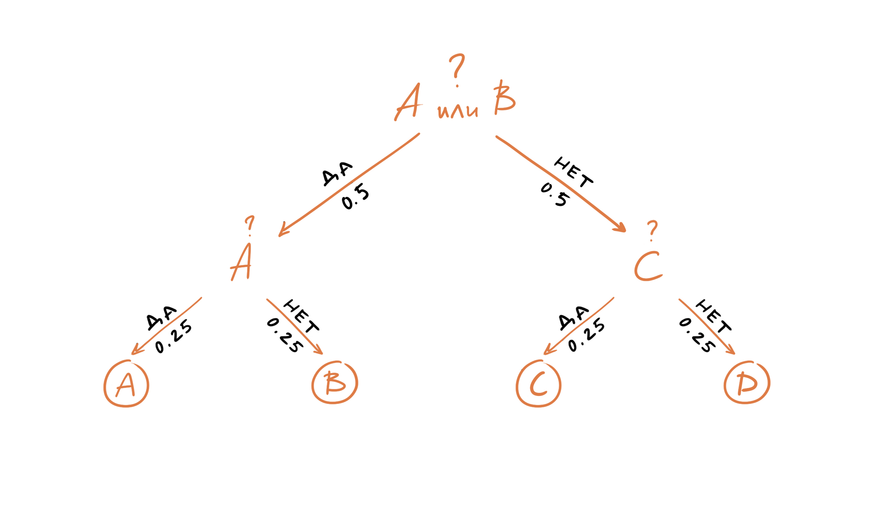
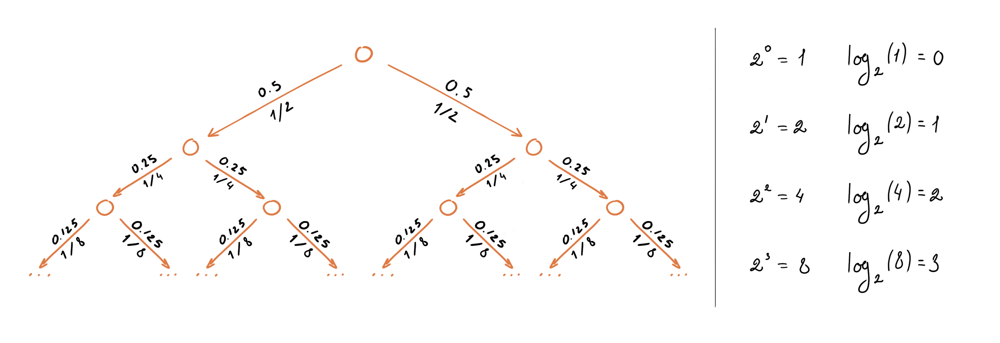
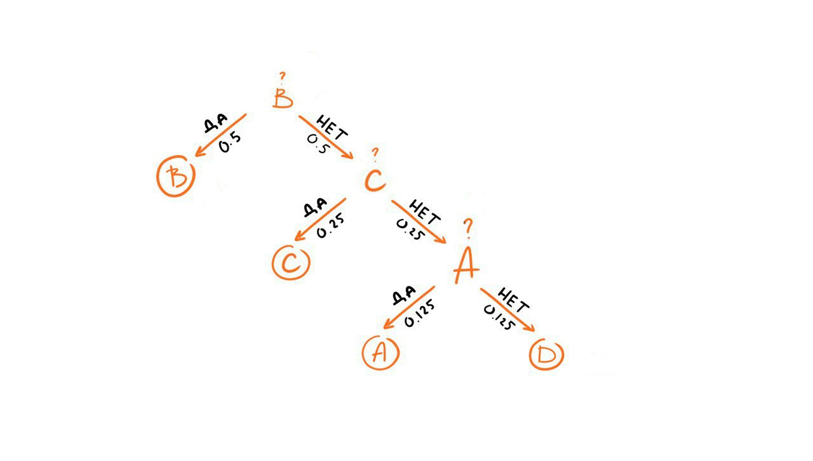

## Энтропия

Допустим у нас есть две механических машины, которые печатают сообщения из алфавита ${A, B, C, D}$. Символы, печатаемые первой машиной, распределены равновероятно, то есть, появление каждого нового символа имеет вероятность $0.25$:

$$
P(A) = 0.25 \\
P(B) = 0.25 \\
P(C) = 0.25 \\
P(D) = 0.25
$$

Символы, печатаемые второй машиной, имеют иное распределение:

$$
P(A) = 0.5 \\
P(B) = 0.125 \\
P(C) = 0.125 \\
P(D) = 0.25
$$

Вопрос «Какая из двух машин предоставляет нам больше информации?» или мы можем переформулировать вопрос: «Если вам необходимо предсказать следующий символ, то сколько вопросов, на которые можно ответить *да* или *нет*, потребуется задать?».

Давайте рассмотрим первую машину. Нашим первым вопросом может быть «Это символ A или B?». Так все символы появляются равновероятно, то с вероятностью $0.5$ это будет «A или B» и с вероятностью $0.5$ это будет «C или D». После того как мы получим ответ, нам останется задать еще один вопрос, например, «Это A?». И после того как мы получим ответ на наш последний вопрос, мы будем знать какой именно символ был следующим в последовательности, выдаваемой машиной один. Таким образом, нам достаточно двух вопросов, чтобы предсказать какой символ был сгенерирован машиной номер один.

Что же касается второй машины, то мы конечно же можем задавть теже самые вопросы, но мы знаем, что у символов другое распределение, например, вероятность появления символа A равна $0.5$, соответственно он будет появляться в последовательности чаще остальных символов, поэтому более разумным было бы задать первый вопрос «Это A?». Если же ответ отрицательный, то следующий символ, который имеет более высокий шанс появиться в последовательности D, поэтому следующим вопросом может быть «Это D?». Если же ответ и на этот вопрос отрицательный, то мы задаем третий и последний вопрос, например, «Это B?».

Сколько в среднем вопросов нам нужно задать, чтобы определить символ в последовательности генерируемой второй машиной?

Для этого мы можем воспользоваться формулой для вычисления математического ожидания дискретной случайной величины:

$$
\begin{aligned}
\textit{#вопросов} =& p_A \times 1 + p_B \times 3 + p_C \times 3 + p_D \times 2 \\
=& 0.5 \times 1 + 0.125 \times 3 + 0.125 \times 3 + 0.25 \times 2 \\
=& 1.75
\end{aligned}
$$

Аналогично посчитаем среднее число вопросов для первой машины:

$$
\begin{aligned}
\textit{#вопросов} =& p_A \times 2 + p_B \times 2 + p_C \times 2 + p_D \times 2 \\
=& 0.25 \times 2 + 0.25 \times 2 + 0.25 \times 2 + 0.25 \times 2 \\
=& 2.0
\end{aligned}
$$

Запишем в общем виде:

$$H = \sum_{i=1}^{n}p_i \times \textit{число_вопросов}_i$$

Где:

$$\textit{число_вопросов}_i = \log_2\left(\frac{1}{p_i}\right)$$

Окончательно можем записать формулу для вычисления энтропии как:

$$H = \sum_{i=1}^{n}p_i \times \log_2\left(\frac{1}{p_i}\right) = -\sum_{i=1}^{n}p_i \times \log_2(p_i)$$

## Кросс-энтропия

Давайте предположим, что у нас есть еще одна машина, которая генерирует теже символы, но с другим распределением:

Что произойдет, если вы будете задавать вопросы опираясь на распределение первой машины, несмотря на то, что символы были сгенерированы второй машиной, которая имеет иное распределение (и наоборот). Давайте оценим среднее число вопросов в этом случае, для этого воспользуемся формулой перекрестной энтропии (cross-entropy):

$$H_{p}(q) = \sum_{i=1}^{n}q_i \times \log_2 \Bigg(\frac{1}{p_i}\Bigg)$$

$$
\begin{aligned}
H_{p}(q) =& \sum_{i=1}^{n}q_i \times \log_2 \Bigg(\frac{1}{p_i}\Bigg) \\
=& q_A \times \log_2\Bigg(\frac{1}{p_A}\Bigg) + q_B \times \log_2\Bigg(\frac{1}{p_B}\Bigg) + q_C \times \log_2\Bigg(\frac{1}{p_C}\Bigg) + q_D \times \log_2\Bigg(\frac{1}{p_D}\Bigg) \\
=& 0.5 \times \log_2\Bigg(\frac{1}{0.125}\Bigg) + 0.125 \times \log_2\Bigg(\frac{1}{0.5}\Bigg) + 0.125 \times \log_2\Bigg(\frac{1}{0.25}\Bigg) + 0.25 \times \log_2\Bigg(\frac{1}{0.125}\Bigg) \\
=& 1.5 + 0.125 + 0.25 + 0.75 \\
=& 2.625
\end{aligned}
$$

$$
\begin{aligned}
H_{q}(p) =& \sum_{i=1}^{n}p_i \times \log_2 \Bigg(\frac{1}{q_i}\Bigg) \\
=& p_A \times \log_2\Bigg(\frac{1}{q_A}\Bigg) + p_B \times \log_2\Bigg(\frac{1}{q_B}\Bigg) + p_C \times \log_2\Bigg(\frac{1}{q_C}\Bigg) + p_D \times \log_2\Bigg(\frac{1}{q_D}\Bigg) \\
=& 0.125 \times \log_2\Bigg(\frac{1}{0.5}\Bigg) + 0.5 \times \log_2\Bigg(\frac{1}{0.125}\Bigg) + 0.25 \times \log_2\Bigg(\frac{1}{0.125}\Bigg) + 0.125 \times \log_2\Bigg(\frac{1}{0.25}\Bigg) \\
=& 0.125 + 1.5 + 0.75 + 0.25 \\
=& 2.625
\end{aligned}
$$

Чтобы посчитать сколько информации будет потеряно, когда мы аппроксимируем одно распределение другим, можно использовать «расстояние» Кульбака-Лейблера (KL divergence):

$$D_q(p) = H_q(p) − H(p)$$

Для нашего примера получим:

$$D_q(p) = H_q(p) − H(p) = 2.625 - 1.75 = 0.875$$

## Кросс-энтропия как функция потерь

Логистическая функция потерь (binary cross-entropy):

$$L = -\frac{1}{N}\sum_{i=1}^{N}y_i\log_2(\hat{y_i}) + (1 - y_i)\log_2(1-\hat{y_i})$$